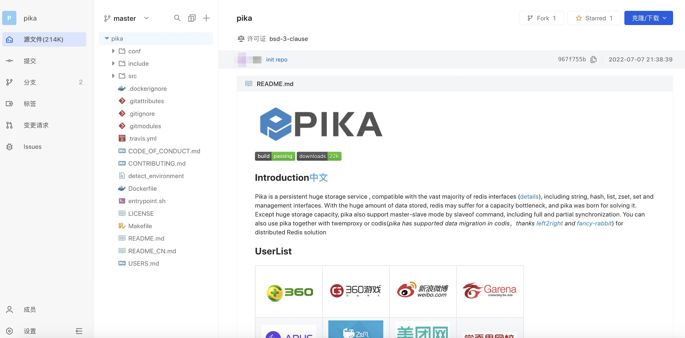
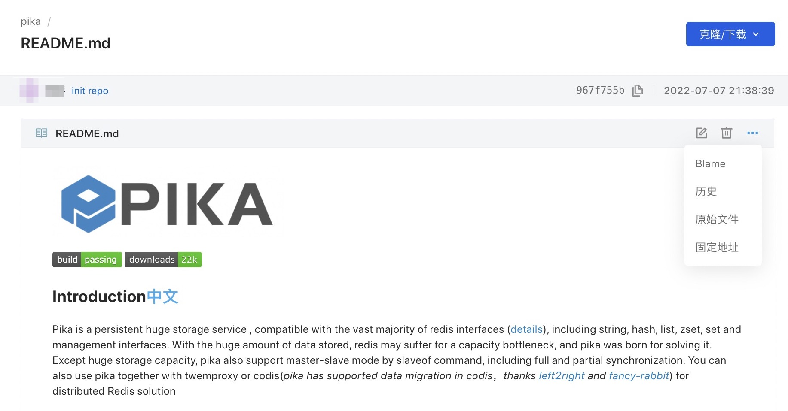
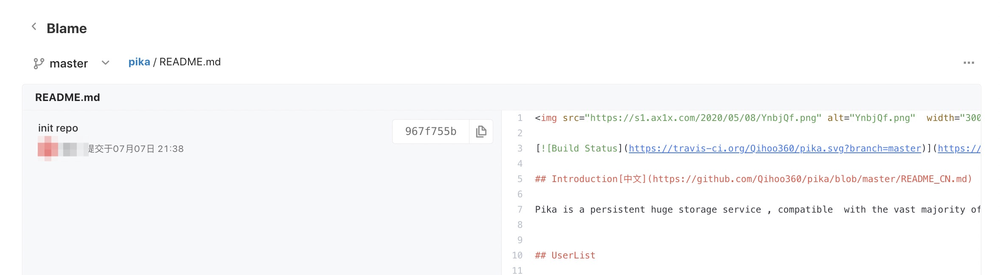
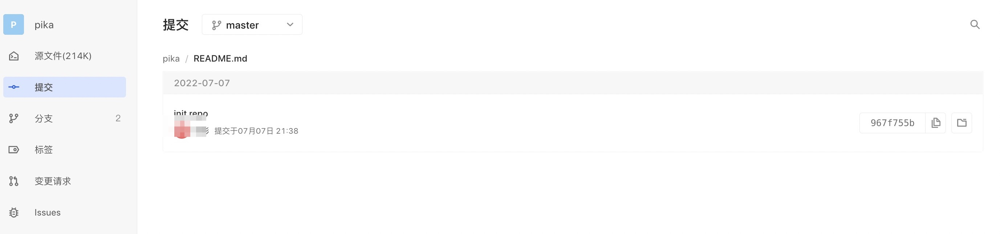
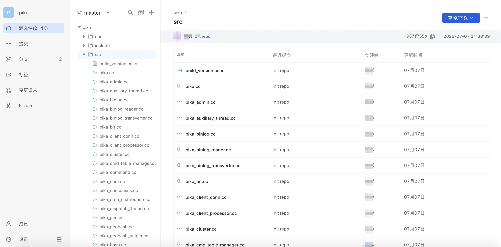

The AtomGit platform supports viewing the file list in a tree structure. Supports file creation, file upload, and file search in the tree list.
Switch the tree node on the left and click on the file to display the file content:

File operation: Supports viewing file details, Blame information, submission history, original files, and fixed addresses.

- View file details

-Blame information

- Submission history

Click on the folder in the directory tree to display the file list under the folder and the corresponding submission information:

