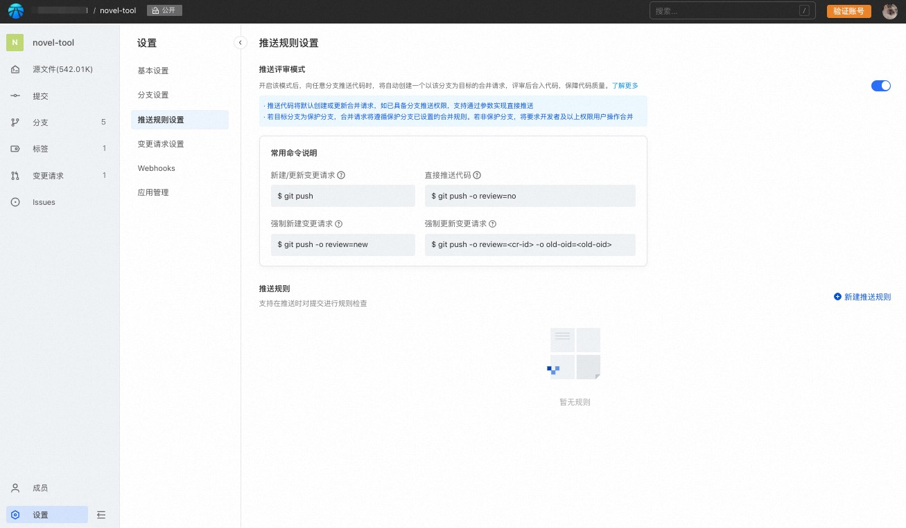

## pr-mode

The platform supports pr-mode. Executing git push in this mode will automatically create a review and support review of submissions.

### pr-mode and its advantages

##### pr-mode can bring users a new and efficient code review experience

From a developer's perspective, initiating a code review no longer requires creating a new branch, nor does it require switching to the browser to create a code review after development is completed. You can directly execute git push to initiate a review with one click;
From the perspective of managers, it can be set up so that when developers push code to the warehouse, they no longer directly update the code of the branch, but automatically create a code review to ensure code quality through review;

Comparison between pr-mode and existing branch mode:
|     | Branch mode  |pr-mode  |
|  ----  | ----  |----  |
| commit  | commit in feature branch |commit in main branch directly |
|code review | web | excute git push |
|update code review | update feature branch | git push |
|push permission| develop and higher |viewer and higher |
|code quality| Only protected branches |all branch |

##### Advantage of pr-mode

* Contribute code to the warehouse and initiate code review. You no longer need to create a new branch. You can just modify and submit it directly on the trunk, avoiding redundant branch management costs;

* git push no longer directly pushes branch content, but creates/updates code reviews;

* If the code needs to be patched, continue to execute git push after submission, and the initiated review will be automatically updated;

* Contributing code to the warehouse no longer requires granting developer permissions. You can contribute code with the viewer permissions of the warehouse, and the contributed code needs to be reviewed before it can be officially incorporated into the code base. Therefore, the permission to directly write the library can be minimized to a few managers, while most developers only need read permission, reducing the risk of the code library being accidentally modified;

* Support specifying push options to control specific push behavior;

## Open pr-mode

In the warehouse settings - push rule settings, you can see the pr-mode switch. Click this switch to turn on/off the pr-mode function:


> Important
> After turning on pr-mode, the behavior of git push will be changed. Please know and understand it before turning on pr-mode:
>
> * After pr-mode is turned on, executing git push no longer directly updates the remote code (even if you have developer rights in the warehouse), but automatically creates/updates the code review;
> * Viewers of the warehouse can initiate a review through git push, but please be assured that the code has not yet been merged into the branch. It needs to be manually merged after passing the branch review and merge requirements;
> * Since git push does not directly update the code but creates a review, the webhook of the push event will not be triggered;
> * Users can create, edit or delete files through review on the web page;

## Use pr-mode to collaborate

Below, we use several practical examples to illustrate how to use pr-mode for development collaboration.

### Automatically create reviews

Suppose we now receive a development task and need to develop a new feature. Using the traditional branch model, we need to check out a branch, develop on the branch, push the branch, and then initiate review of the feature branch to the trunk. After using pr-mode, this process is simplified to only two steps:

* develop on main branch
* git push

Let’s take a closer look below.
In the example repository, we develop on the master branch and create a commit 27e76f58.

```bash
$ git log
commit 27e76f582ca7207a695dd8762b66ef443adcc572 (HEAD -> master)
Author: Code User <code.user@example.com>
Date:   Tue Oct 11 10:16:18 2022 +0800

    feat: new feature

    Signed-off-by: Code User <code.user@example.com>

commit 44094ec92eb122deab5a0367552bd081540c4353 (origin/master, origin/HEAD)
Author: Code User <code.user@example.com>
Date:   Tue Oct 11 10:09:39 2022 +0800

    Initial commit
```

then, push the commit to remote,excute git push：

```
$ git push
enuming: 4, done.
counting: 100% (4/4), done.
Compression using 12 threads
compressing: 100% (2/2), done.
writing: 100% (3/3), 310 bytes | 310.00 KiB/s, done.
Total 3 (difference 0), mux 0 (difference 0), packet mux 0
remote: +-----------------------------------------------------------------------------------+
remote: | The following tips are provided by Code:                                        |
remote: +-----------------------------------------------------------------------------------+
remote: | change request #31620 has been created, please visit:                              |
remote: | https://xxx.com/demo/change_request/31620       |
remote: +-----------------------------------------------------------------------------------+
To https://xxx.com/demo.git
 * [new reference]         master -> refs/change-requests/31620/head
```

It can be seen that after pr-mode is turned on, git push does not directly update the remote code, but creates a code review with the ID 31620.

The source of this code review is the latest local commit, and the target is the current branch.

We can confirm this through the details of the code review:


This way, you no longer need to create feature branches or switch to the browser to create reviews, simplifying the steps of creating code reviews.

At the same time, git push no longer directly updates the code, but must be reviewed before being merged to ensure code quality.

### Automatically update reviews

In the process of code review, it is often necessary to modify the code multiple times based on the reviewer's opinions to finally meet the code admission standards. So, after modifying the code, how to update the corresponding code review? This can be done by executing `git push` again. Let’s look at a practical example below.

Based on 27e76f58, we modified some code based on review comments and added a commit e00db452.

```
$ git log
commit e00db4522f2d6ca5b42377ca76c7b3a7e12db8a5 (HEAD -> master)
Author: Code User <code.user@example.com>
Date:   Tue Oct 11 11:09:42 2022 +0800

    feat: fix comment

    Signed-off-by: Code User <code.user@example.com>

commit 27e76f582ca7207a695dd8762b66ef443adcc572
Author: Code User <code.user@example.com>
Date:   Tue Oct 11 10:16:18 2022 +0800

    feat: new feature

    Signed-off-by: Code User <code.user@example.com>

commit 44094ec92eb122deab5a0367552bd081540c4353 (origin/master, origin/HEAD)
Author: Code User <code.user@example.com>
Date:   Tue Oct 11 10:09:39 2022 +0800

    Initial commit
```

then, excute `git push` again：

```
$ git push
enuming: 4, done.
counting: 100% (4/4), done.
Compression using 12 threads
compressing: 100% (2/2), done.
writing: 100% (3/3), 310 bytes | 310.00 KiB/s, done.
Total 3 (difference 0), mux 0 (difference 0), packet mux 0
remote: +-----------------------------------------------------------------------------------+
remote: | The following tips are provided by Code:                                        |
remote: +-----------------------------------------------------------------------------------+
remote: | change request #31620 has been updated, please visit:                              |
remote: | https://xxx.com/demo/change_request/31620       |
remote: +-----------------------------------------------------------------------------------+
To https://xxx.com/demo.git
   27e76f582c..e00db4522f  master -> refs/change-requests/31620/head
```

It can be seen from the prompt information that this push updates the code review with ID 31620.

Looking at the review details, we see that the source version of the code review has changed to e00db4522, and the submission history has also changed to 2.


If the code still needs to be modified, just repeat the above process.

### New review

Executing the `git push` command repeatedly will automatically update existing reviews. What if we don't want to update the review, but want to create a new one? This can be achieved by adding the `push option` to the push command. Specifically, execute `git push -o review=new` to create a new code review.
Change some code locally, execute `git push -o review=new` again, and successfully create a code review with ID 31626.

```
$ git push -o review=new
enuming: 4, done.
counting: 100% (4/4), done.
Compression using 12 threads
compressing: 100% (2/2), done.
writing: 100% (3/3), 310 bytes | 310.00 KiB/s, done.
Total 3 (difference 0), mux 0 (difference 0), packet mux 0
remote: +-----------------------------------------------------------------------------------+
remote: | The following tips are provided by Code:                                        |
remote: +-----------------------------------------------------------------------------------+
remote: | change request #31626 has been created, please visit:                              |
remote: | https://xxx.com/demo/change_request/31626       |
remote: +-----------------------------------------------------------------------------------+
To https://xxx.com/demo.git
 * [new reference]         master -> refs/change-requests/31626/head
```

It should be noted that if a review with exactly the same source and target already exists when pushing, then you will not be able to create a new review.

```
$ git push -o review=new
Total 0 (difference 0), multiplex 0 (difference 0), packet multiplex 0
remote: +-----------------------------------------------------------------------------------+
remote: | The following tips are provided by Code:                                        |
remote: +-----------------------------------------------------------------------------------+
remote: | change request create failed. There exists a same change request in progress:       |
remote: | https://xxx.com/demo/change_request/31620       |
remote: +-----------------------------------------------------------------------------------+
To https://xxx.com/demo.git
 ! [remote rejected]       master -> master (create CR failed)
error: cannot push some refs to 'https://xxx.com/demo.git'
```

### Update specified review

When there are multiple open code reviews at the same time, when executing `git push`, it will fail because it cannot determine which review you want to update.

```
$ git push
enuming: 5, done.
counting: 100% (5/5), done.
Compression using 12 threads
compressing: 100% (2/2), done.
writing: 100% (3/3), 310 bytes | 310.00 KiB/s, done.
Total 3 (difference 0), mux 0 (difference 0), packet mux 0
remote: +-------------------------------------------------------------------------------------------------+
remote: | The following tips are provided by Code:                                                      |
remote: +-------------------------------------------------------------------------------------------------+
remote: | You need to manually specify the change request to update because there are already              |
remote: | multiple change requests that you created earlier for the same target branch:                    |
remote: |                                                                                                 |
remote: | * [ID: 31626] https://xxx.com/demo/change_request/31626       |
remote: | * [ID: 31620] https://xxx.com/demo/change_request/31620       |
remote: |                                                                                                 |
remote: | Then, update specific change request based on it's ID (CR-ID):                                   |
remote: |     git push -o review=<CR-ID>                                                                  |
remote: |                                                                                                 |
remote: | Or you can create a new one:                                                                    |
remote: |     git push -o review=new                                                                      |
remote: +-------------------------------------------------------------------------------------------------+
To https://xxx.com/demo.git
 ! [remote rejected]       master -> master (unable to determine which mr to update)
error: cannot push some refs to 'https://xxx.com/demo.git'
```

The prompt information given shows that there are two reviews pointing to the same target branch, with IDs 31626 and 31620 respectively, so it is impossible to determine which review you want to update. There are two solutions at this time:

* Use -o review=new to create a new code review.
* Use -o review={MR-ID} to explicitly give the ID of the review you want to update.

The first method has been demonstrated in the section on creating a new review. Let's look at how to update a specified review.
If we want to update the review 31626 at this time, the specific command is: `git push -o review=31626`.

```
$ git push -o review=31626
enuming: 5, done.
counting: 100% (5/5), done.
Compression using 12 threads
compressing: 100% (2/2), done.
writing: 100% (3/3), 310 bytes | 310.00 KiB/s, done.
Total 3 (difference 1), mux 0 (difference 0), packet mux 0
remote: +-----------------------------------------------------------------------------------+
remote: | The following tips are provided by Code:                                        |
remote: +-----------------------------------------------------------------------------------+
remote: | change request #31626 has been updated, please visit:                              |
remote: | https://xxx.com/demo/change_request/31626       |
remote: +-----------------------------------------------------------------------------------+
To https://xxx.com/demo.git
   0ba010f2ff..037578c634  master -> refs/change-requests/31626/head
```

In this way, the code review with ID 31626 is updated.

### Resolve conflict for update reviews

Sometimes, when we want to update a code review, we find that the review may have been updated by another user. At this time, in order to avoid other users' updates being overwritten, the update will fail. Assume that we want to update the review 31644 at this time, execute: `git push -o review=31644`

```
$ git push -o review=31644
enuming: 4, done.
counting: 100% (4/4), done.
Compression using 12 threads
compressing: 100% (2/2), done.
writing: 100% (3/3), 310 bytes | 310.00 KiB/s, done.
Total 3 (difference 0), mux 0 (difference 0), packet mux 0
remote: +--------------------------------------------+
remote: | The following tips are provided by Code: |
remote: +--------------------------------------------+
remote: | CR is diverged with this push              |
remote: +--------------------------------------------+
To https://xxx.com/demo.git
 ! [remote rejected]       master -> master (CR is diverged with this push)
error: cannot push some refs to 'https://xxx/demo.git'
```

The prompt message indicates that this push will cause a review conflict and the update failed. At this point we have two options:

1. Pull updates from other users and resolve them locally before updating the review.
2. Force refresh the review.

Let’s look at the first way first. Pull updates and resolve them locally before updating the review.

First, we need to execute `git fetch origin refs/change-requests/{mr-id}/head`, where mr-id is 31644, so the command we need to execute is: `git fetch origin refs/change-requests/31644 /head`

```
$ git fetch origin refs/change-requests/31644/head
from https://xxx.com/demo
 * branch                  refs/change-requests/31644/head -> FETCH_HEAD
```

Then, we rebase the local changes to the reference corresponding to the review. Execute `git rebase FETCH_HEAD`. There may be conflicts in the rebase operation, please resolve them based on the actual situation.

```
$ git rebase FETCH_HEAD
rebase success and update refs/heads/master。
```

In this way, the local has the remote code, and then the push is executed again.

```
$ git push -o review=31644
enuming: 4, done.
counting: 100% (4/4), done.
Compression using 12 threads
compressing: 100% (2/2), done.
writing: 100% (3/3), 310 bytes | 310.00 KiB/s, done.
Total 3 (difference 0), mux 0 (difference 0), packet mux 0
remote: +-----------------------------------------------------------------------------------+
remote: | The following tips are provided by Code:                                        |
remote: +-----------------------------------------------------------------------------------+
remote: | change request #31644 has been updated, please visit:                              |
remote: | https://xxx.com/demo/change_request/31644       |
remote: +-----------------------------------------------------------------------------------+
To https://xxx.com/demo.git
   a4a2cad45c..8da076fb44  master -> refs/change-requests/31644/head
```

In this way, the code review 31644 is updated.

### Force review refresh

Sometimes, we don’t want to merge the changes of other users and want to force the review to be refreshed to the local version. How should we do this?
At this point, we need to know two values.

One is the code review ID, which is the last number of the code review URL. For example, if the URL of the code review is <https://xxxx.com/demo/change_request/31644>, then the ID of this review is 31644.

The other is the source version for code review. Available on the code review details page. The corresponding source version here is 8da076fb.


then, we can execute `git push -o review={mr-id} -o old-oid={old-oid}`，for this example，command is `git push -o review=31644 -o old-oid=8da076fb`。

In this way, the review 31644 is refreshed into the local version. During this process, the modifications of other users will be overwritten, so only execute this command when you clearly want to force a version refresh to avoid losing the modifications of other users.

```
$ git push -o review=31644 -o old-oid=8da076fb
Total 0 (difference 0), multiplex 0 (difference 0), packet multiplex 0
remote: +-----------------------------------------------------------------------------------+
remote: | The following tips are provided by Code:                                        |
remote: +-----------------------------------------------------------------------------------+
remote: | change request #31644 has been updated, please visit:                              |
remote: | https://xxx.com/demo/change_request/31644       |
remote: +-----------------------------------------------------------------------------------+
To https://xxx.com/demo.git
   8da076fb44..8da076fb44  master -> refs/change-requests/31644/head
```

### Skip the review and update the code directly

Sometimes, we may only make some minor submissions, such as changing typos in code comments, and want to skip code review. What should we do? At this point, we can use the `git push -o review=no` command to skip creating a code review. The behavior of the command is consistent with executing git push when pr-mode is not enabled.
> It should be noted that you need to have the push permission of the corresponding branch to directly push the code using review=no.

### Other tips

To update a review, you need to be the reviewer or the author of the review, otherwise the update will fail.

```
remote: +---------------------------------------------------------------------+
remote: | The following tips are provided by Code:                          |
remote: +---------------------------------------------------------------------+
remote: | change request #31644 update failed.                                 |
remote: | You need to be the author or reviewer to update this change request. |
remote: +---------------------------------------------------------------------+
```
