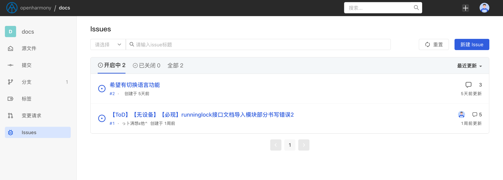
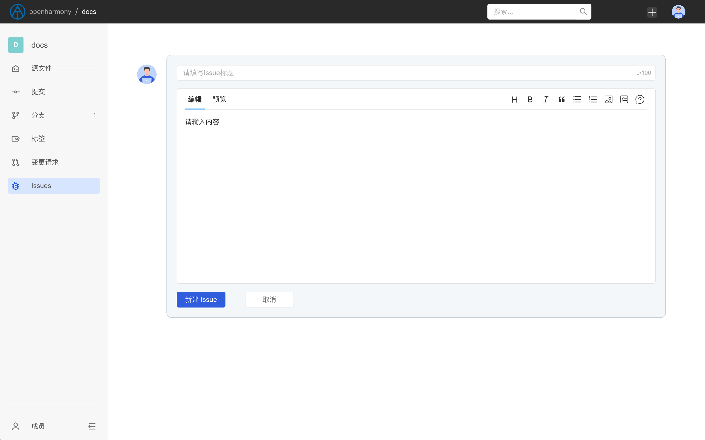
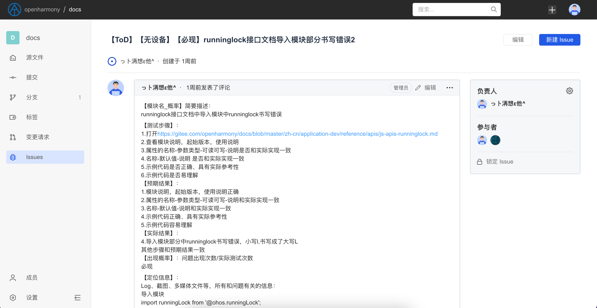
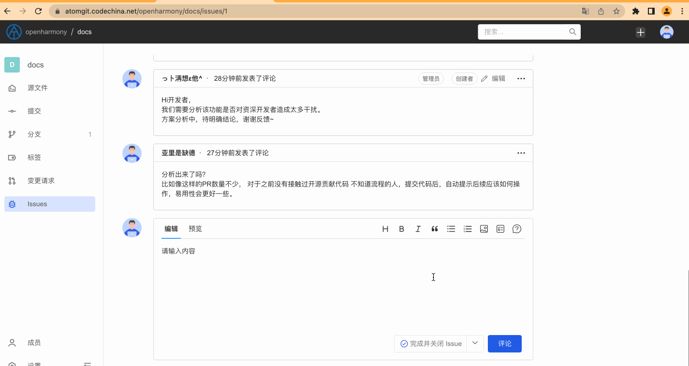

## Issue

AtomGit provides the Issue function for feedback tracking bugs and recording new ideas/requirements. Through Issues, you can:

- Communicate and discuss with community users
- Feedback and track bugs in the code base
- Record new ideas
- Track the status of new requirements

In short, we recommend that you discuss and record all issues related to the code base through Issues.

### About Issue

When you enter a code base (any publicly accessible code base is acceptable), you can click the Issue button on the left to view the Issue list of the code base. Usually you can see the following information:

1. **Issue title**, used to describe what the main content of this Issue is.
2. **Issue status**, Issue status is divided into two types: `open` and `closed`
3. **Issue creation time**
4. **Creator of Issue**
5. **Issue assigned person in charge**
6. **Number of comments discussed in the Issue**
7. **Issue last updated**

### Create Issue

You can submit an Issue in a publicly accessible code base or a private code base to which you have permission. When creating an Issue, you need to provide the following information:

1. Issue title
2. A detailed description of the Issue. The more detailed this part is, the better. If it is a bug feedback, it is best to provide detailed contextual information so that project members can locate the problem.

When the Issue is created successfully, the system will jump to the Issue details page.

### Assign Issue

After the Issue is submitted, project members can assign responsible persons to the Issue. The assignable responsible persons of the Issue include the participants of the Issue (creators and users participating in the Issue discussion) and code base members (including `Viewers`, `Developer` and `Administrator` three types of roles)

### Lock Issue

When an Issue is locked, only code base members will be allowed to discuss it, and non-code base members will not be able to submit comments.

### Close Issue

When the person in charge of the Issue assignment thinks that the Issue can be closed, he can close it through the close button at the bottom of the page. There are usually two situations for closing an Issue:

1. **Skip and close the Issue**, this will mean that the person in charge believes that the issue does not require further attention, and may be an invalid bug or does not meet the needs of the project plan, etc.
2. **Complete and close the Issue**, which means that the person in charge has completed handling the issues reported in the Issue

People with permission to close an issue include the issue's creator, the currently assigned owner, and code base members.
