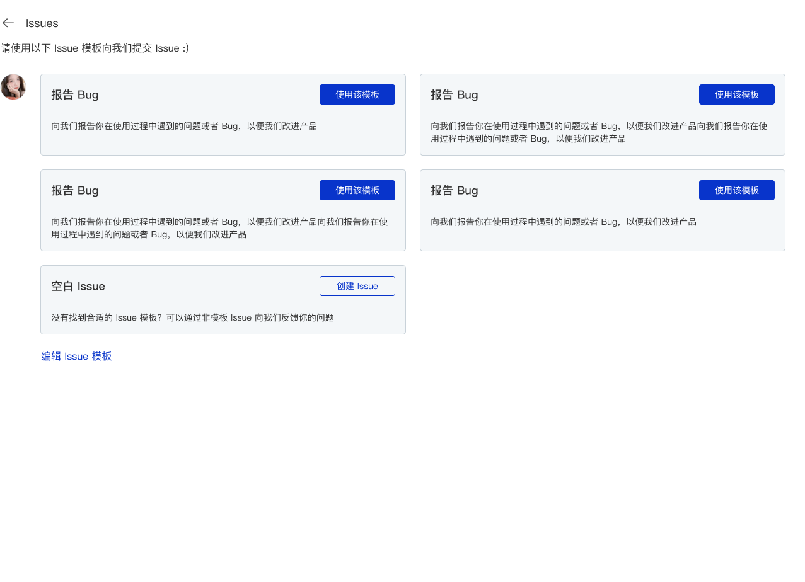

## Issue Template

AtomGit provides the Issue template function. When the Issue template function is turned on, when users submit an Issue to your code base, the corresponding Issue will be created from the Issue template you specified, which facilitates better processing of user feedback issues. Classification processing.



### Enable Issue Template

When a file with *.md format exists in the following path in the main branch of your code base, you can enable the Issue template function

- `.atomgit/ISSUE_TEMPLATE/` dir
- `.github/ISSUE_TEMPLATE/` dir

### Configure Issue Template

When configuring the Issue template, you can refer to the following steps:

1. Create `.atomgit/ISSUE_TEMPLATE` or `.github/ISSUE_TEMPLATE` directory
2. Create a new `test.md` file
3. Configure the front-matter information in the newly created markdown file, including the introduction of the ISSUE template, the ISSUE title, the designated person in charge, the designated Label, etc.
4. Add body content to the newly created markdown file. This content will be filled in the description as the default content when the user creates a new Issue.

#### Front-matter

Currently we support the following markdown front-matter configurations:

|   Field  | desc    |   remark    |
|   --  | -- |  --   |
|   name  |   Template name |   Use double quotes for Chinese characters    |
|   about   |   aboute    | Use double quotes for Chinese characters    |
|   title |   Issue preset title  |   Use double quotes for Chinese characters    |
|   labels |   Issue labels，Support multiple  | Multiple brackets need to be used. When a label does not exist, the label will not be displayed when creating an Issue. |
|   assignees   | Issue default assignee    | assignee ID，without @    |

### Issue template example

Here is a simple Issue template example that you can adapt to the needs of your own code base:

```markdown
---
name: "Bug Report"
about: "Report to us any problems or bugs you encounter during use so that we can improve the product"
title: "【BUG】:"
labels: ["BUG","Product Optimization"]
assignees: 'xiongjiamu'
---

### BUG Types

<!-- 
Please describe the type of BUG you encountered here so that we can locate the problem more quickly, such as UI, function, experience, etc.
-->

### Reproduction steps

<!-- 
Please describe here the page and steps you took when you encountered this BUG.
-->
```

The above template is a template for【Report to us any problems or bugs you encounter during use so that we can improve the product】的【Bug Report】Issue template，When created using this template, an Issue whose title starts with ([BUG]:) by default, is assigned to [xiongjiamu] by default, and whose Labels is [BUG, Product Optimization]。
