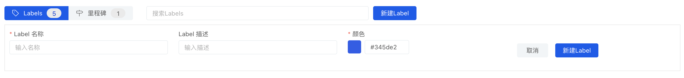
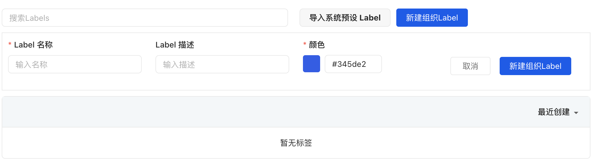
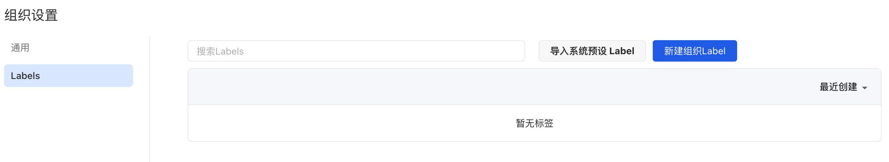
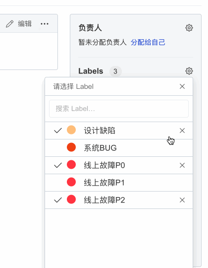

## 标记

标记是[看板](https://#)的重要内容之一，可以用于管理[Issue](issue)和[变更请求](change-request)，通过标记功能，你可以很方便的实现：

- 使用颜色和文字（例如 `bug`, `新功能`或 `文档` 等）对 Issue 和变更请求进行分类
- 通过标记来筛选和过滤 Issue 和变更请求

### 新建标记

AtomGit 提供了代码库标记和组织标记两种不同类型的标记，其中：

- 代码库标记，代码库标记只能用于特定的代码库，适用于比较独立的项目（比如个人项目）
- 组织标记，组织标记可以适用于组织下所有代码库，组织下新建的代码库会继承组织标记（当然你也可以在单个代码库中使用代码库标记）

> 注：你至少需要是代码库或组织的`管理员`才可以使用新建、编辑、删除标记等功能

#### 新建代码库标记

1. 打开代码库的 Issue 页
1. 点击【Labels】按钮
1. 点击【新建 Label】按钮，填写标记的相关信息
    - 标记名称
    - 标记描述，用来详细描述标记的具体作用
    - 标记颜色，可以选择系统预设的颜色或输入十六进制颜色码
1. 点击【新建 Label】保存并新建标记

#### 新建组织标记

1. 打开组织设置页
1. 点击【Labes】选项
1. 点击【新建组织 Label】按钮，填写标记的相关信息
    - 标记名称
    - 标记描述，用来详细描述标记的具体作用
    - 标记颜色，可以选择系统预设的颜色或输入十六进制颜色码
1. 点击【新建组织 Label】保存并新建组织标记

### 导入系统预设标记

当代码库标记、组织标记内容为空的时候，也可以使用**导入系统预设 Label**来快速创建一组标记。

### 关联标记

在 issue 页面，你可以通过右侧【Labels】的设置按钮来为 issue 关联标记。

> 注：你至少需要是代码库或组织的`开发者`权限才可以使用关联标记、移除标记等功能

