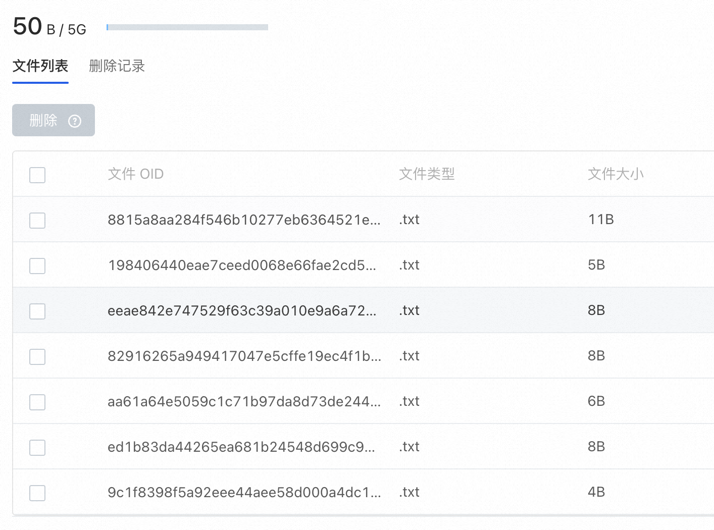

# Large File Storage(Git LFS)

The AtomGit platform supports Git LFS to manage large files in the warehouse.

## Install

Git LFS is an open source service. Please refer to the source code and installation method:[https://git-lfs.com/](https://git-lfs.com/)

## Use

### initialization

After installing Git LFS, execute `git lfs install` to initialize the git hook

```shell
$ git lfs install
Updated git hooks.
Git LFS initialized.
```

### Add files to LFS management

If you want to use LFS to manage png files, execute: `git lfs track "*.png"` in the warehouse, and then use git to submit and push normally. Files of png type are automatically managed using LFS and no additional operations are required.

It should be noted that executing `git lfs track` will only affect files added to the warehouse later, and will not affect historical files that already exist in the warehouse.

If you need to add historical files to LFS management, you need to perform a migration operation.

### View files managed by LFS

Execute `git lfs ls-file` to view files managed using LFS

```shell
$ git lfs ls-files
2da026638a * <file1>
3176f6f797 * <file2>
```

You can also view and manage large files in the warehouse in `Settings - Large File Storage`



## Migration of historical files
>
> The migration operation will rewrite the repo's commit history, so please operate with caution.

If you want to use LFS to manage the historical files in the warehouse, you need to perform a migration operation. For example, if we want to use LFS to manage png files in the master branch, then execute:

```shell
git lfs migrate import --include-ref=master --include="*.png"
```

You will see output similar to this, indicating that the migration is complete:

```shell
migrate: Sorting commits: ..., done.
migrate: Rewriting commits: 100% (2/2), done.
  master 2d2c813aac4b2247e4b79b3721cca45580f15282 -> 5634c182663a24617bd26d0d82a3966686687173
migrate: Updating refs: ..., done.
migrate: checkout: ..., done.
```

Then execute `git push --force` to push the changes to the remote end.

## Support large file push

By default, when using Git LFS to push large files, the size of a single file cannot exceed 5GB.
If there is a need for a single file exceeding 5GB, it can be accomplished through the `xlfs` extension plug-in.

### Installation and configuration

Download the binary program corresponding to the platform from the [xlfs Release](https://atomgit.com/OpenAtomFoundation/xlfs/tags?tab=release) page, add the path to the executable file to `PATH`, and execute `xlfs version` to verify correct installation

```shell
$ xlfs version
xlfs version 1.0.0
git-lfs version 2.13.3 (GitHub; darwin amd64; go 1.16.2; git a5e65851)
```

After the installation is complete, execute `git config lfs.customtransfer.xlfs.path xlfs` in the repository to enable Git LFS support for files exceeding 5GB.
