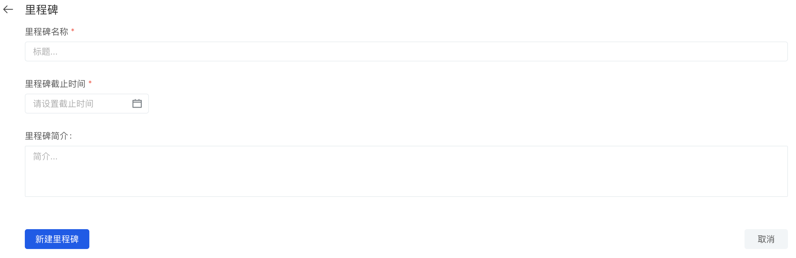
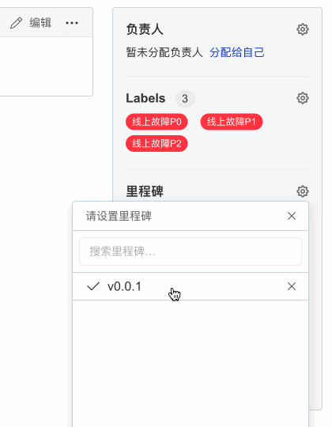

## Milestone

Similar to [Label](label), milestone is also a tool for managing issues and change requests. The introduction of deadlines allows you to better track and view the progress of issues and change requests.

**Agile Sprint**

Milestones can be used in Agile Sprints to track all issues and change requests related to a specific sprint:

1. Set the milestone deadline to represent the end time of the agile sprint
1. Set the milestone title to the name of the agile sprint, such as `#1 sprint`
1. Associate it with the required milestone in the issue or change request, and add it to the agile Sprint.

**Release**

Milestones can also be used with releases:

1. Set the deadline of the milestone to the date planned to be released
1. Set the milestone title to your distribution, for example `v1.0.2`
1. Associate it to the required milestone in the issue or change request, and add it to the release version

### Create milestone

> Note: You need to be at least the `maintainer` of the code base or organization to use functions such as creating, editing, and deleting milestones.

1. Open the Issue page of the code base
1. Click the [milestone] button
1. Click the [New Milestone] button and fill in the relevant information about the milestone.
    - milestone name
    - Deadline, the end date of the milestone
    -Introduction to milestone, describing the basic information of milestone
1. Click [New Milestone] to save and create a new milestone.

### Relate milestone

On the issue page, you can associate a milestone with the issue through the setting button [milestone] on the right.

> Note: You need at least `developer` permissions of the code base or organization to use functions such as associating milestones and removing milestones.

