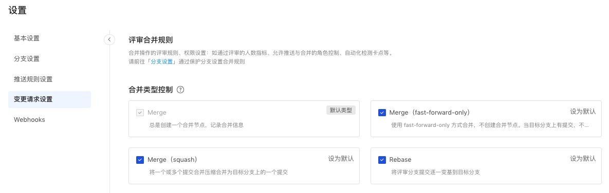

### Pr config

#### Pr config rules

Review rules and permission settings for merge operations: Set protection branch rules in "Settings" - "Branch Settings", see [Protection Branch Rules] (branch).

### Pr config setting

Developers can create change requests that branch to the target branch. Administrators can standardize the configuration of change requests in the code base dimension based on the team's WorkFlow and specifications.

When a certain merge type is set as the default, if the merge type is not selected during the change operation, the merge will be performed according to the default type; if a certain merge type is canceled, the unchecked merge type will not appear in the drop-down selection during merge.

Specific instructions for merging methods:

#### 1、 merge(--no-ff)

The default merge method. Always create a merge request, and the merge commit can record the merge time of the code, the merger information, and hide the review branch development details on the trunk (first parent).

#### 2、 Merge （fast-forward-only）

Use the fast-forward-only method to merge and do not create merge nodes. When there are commits on the target branch and fast-forward cannot be used, the default merge type is merge (create merge node)。

#### 3、 Rebase

Merge to the target branch through Rebase, no Merge node is generated, and no Merge Commit is generated. The Commit record on the source branch before the merge (author information and commit information, but the CommitId may change) will be retained.

#### 4、 Squash

Merge all commits in review into one and keep a clean history on the target branch. Squash merge allows you to compress a series of commits under review into a single commit, and you can customize the commit information of the compression node.

When developing with the Feature branch, sometimes you want to commit changes, but the commit information during development does not necessarily contain important information, so you don't want to include them in the target branch. This way, the history of the integration branch is kept clear with meaningful commit messages and is easier to revert when necessary.
