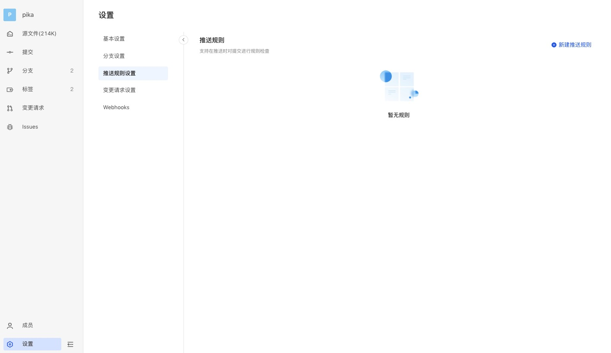
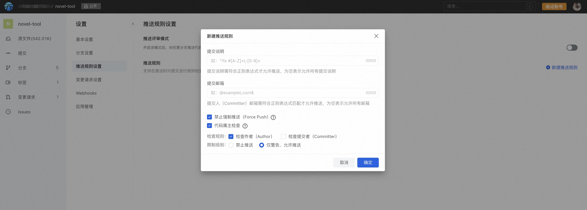
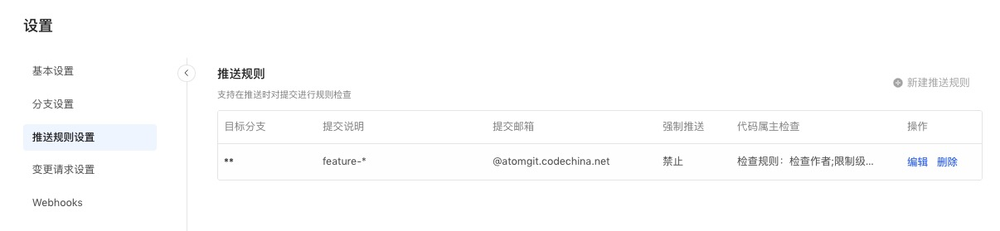
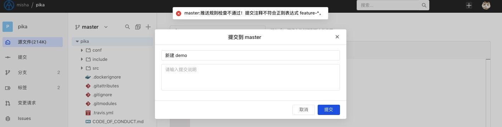
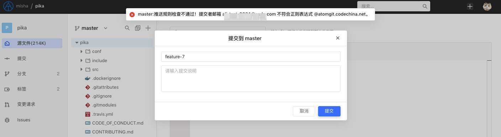
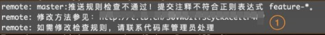
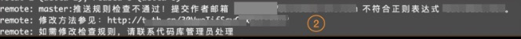

In order to standardize the developer submission format, the platform provides push rules inspection service, supports custom inspection rules, and checks unpushed submissions.

## Create push rules

As a repo maintainer, click "Settings" in the lower left corner to enter the repo settings page and find "push rules settings":

Click to create new push rules and set the rule parameters:

### Commit message

Please use regular expressions to write rules. Submitted comments must match the regular expression to be allowed to be pushed. If left empty, all submitted comments are allowed.

### Commit email

That is, the email address set by git config. Please use regular expressions to write the rules. The submission author's email address must match the regular expression to be allowed to push. If it is empty, all email addresses are allowed.

### Disable Force Push

Forced push means forcing the local code to overwrite the code of the remote warehouse. Since it will directly overwrite the remote submission, especially in the case of version conflicts, it may cause the loss of code and submission records, so it should be used with caution.

In order to avoid the problem of code loss caused by forced push, you can limit the operation by turning on the prohibition of forced push.

When disabling forced push is enabled and there is a fork between the pushed local code and the remote end, the local code cannot be forcibly pushed through git push -f to prevent the server code from being overwritten.

> When the prohibition of forced push is turned on, but there is no fork between the local code and the remote server code, even if you use the git push -f command to push, the effect will be the same as git push and the push can be successful.

### Code owner check

Before starting to use git for version management, we need to configure the user first.

> git config --global user.name "your name"
> git config --global user.email "your email"

Maybe you use it every day, but do you know the difference between the author (Author) and the submitter (Committer) of the submission record?

Git itself allows rewriting history, or committing code on behalf of others. Usually, when we use git log to view historical submission records, what is displayed is the author. We often use Author as the basis for attribution of code statistics. From this perspective, the author Author is directly linked to the code contributor. Therefore, in scenarios such as counting code contributions, it is necessary to standardize the correspondence between the owner of the submitted code and the currently logged-in user on the server.

Normally, the committer is not exposed to the user. It will only be displayed when git log --format is specified (for example, format=fuller). The submitter represents the person who finally submitted this commit record Commit (git config user.name and git config user.email when submitting).
When executing git commit, you can use --author to specify the contributor of this commit record. There are also such examples in the open source community. Although I did not use your code, I used your creativity and still used you as the author to show respect for the originality.

Usually the Commit, Author and Committer generated for the first time are the same person. However, if another person rewrites this Commit using commands such as git cherry-pick, git rebase, git commit --amend, git filter-branch, git format-patch, etc., essentially a new Commit is generated, then the new The Author of the generated Commit is still the original, but the Committer will become the name and email of the user who performed the operation.

So simply understand that Author is the first author and Committer is the person who generates Commit.
The platform supports checking the verified mailbox of the currently logged-in user for Author and Committer. If the mailbox information cannot be matched, it can warn or limit its push to ensure the accuracy of the owner of the code contribution and avoid the calculation of contribution amount due to the inability to match the user. distortion.

### Check when push

Assume the rules are set up as follows:

#### Page operations

When comments during submission do not comply with the rules that have been set, the submission will be rejected:

When the submission email address does not comply with the rules, the submission will also be rejected:

The same goes for merge.

### CLI

When a commit comment does not comply with the rules:

When the submitted email address does not comply with the rules:

