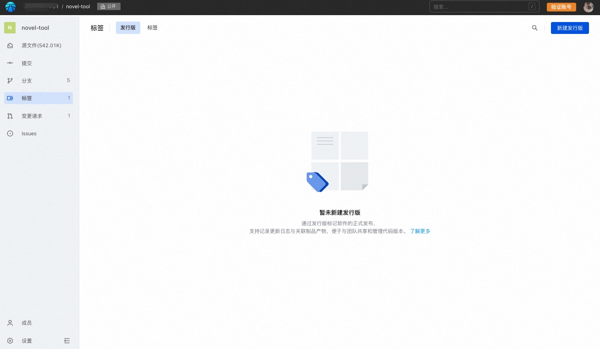
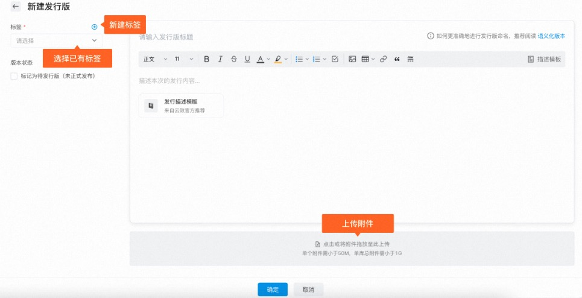
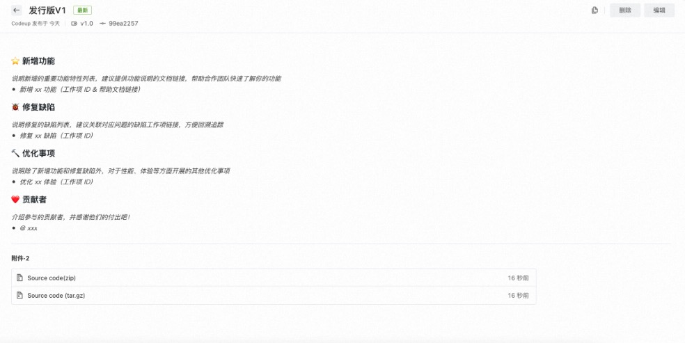
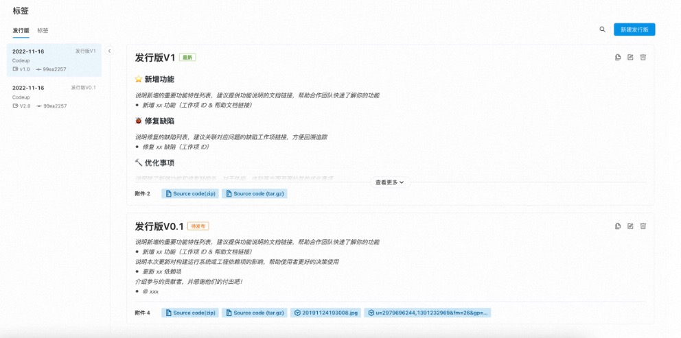

## Release Manage

Release is a release log based on code base tags. By creating a release, it supports recording update logs and associated products, which can better share and manage code versions with the team.

### Create release

1. For repo developers and above, enter the code base details page, click the left navigation > Tags, and select the release version.

2. Click the button in the upper right corner to create a new distribution.

Release content includes:

* Tag: The release needs to be created based on tags, you can choose existing tags or create new tags;
* Version status: Supports setting to release version. This mark indicates that it has not been officially released for production and is a preview;
* Release title: For writing suggestions, see [Semantic Version](https://semver.org/lang/zh-CN/);
* Release description: Describe the specific content of the release. Yunxiao provides a suggested template for reference;
* Attachment: Attachment information of the release version;

> The same distribution supports up to 10 attachments. The size of a single attachment must be less than 50M, and the total attachments in a single database must be less than 1G.

3. Click OK to complete the creation and enter the release details:
After the creation is completed, 2 source code compressed packages will be generated by default for download.

4. Click Return to view the release list:

