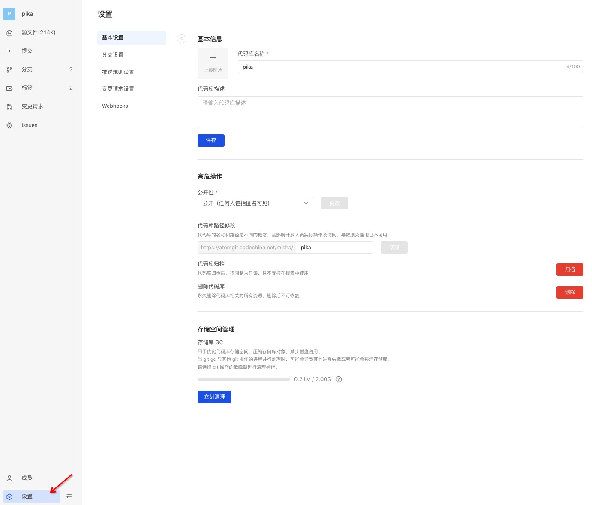
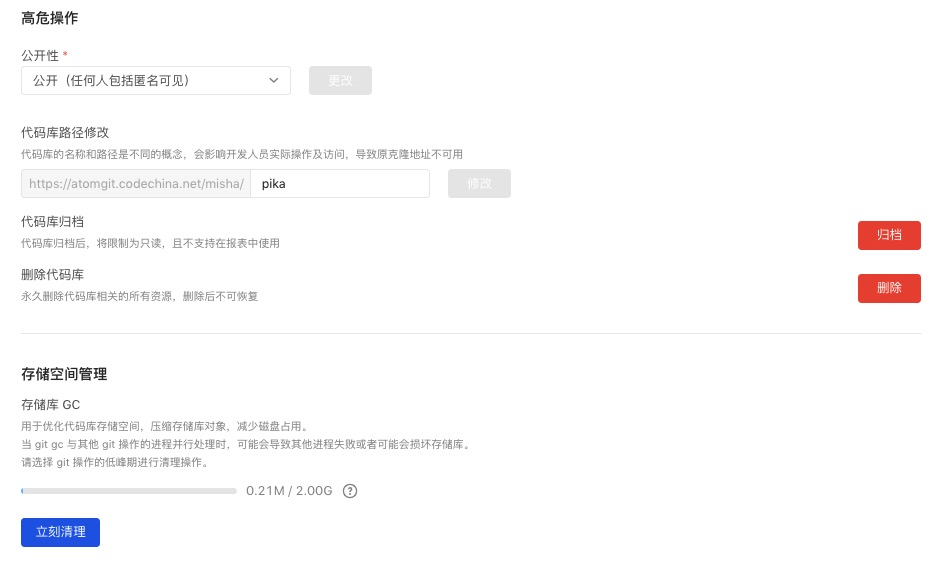

### Basic Info

As a repository maintainer (including inherited organization maintainer), you can modify the basic information of the repository, including name, description, cover, and visibility, so that other developers can find the repo faster.

### High-risk operations

There are two types of visibility:

- Public: visible to anyone including anonymous
- Private: visible only to code base members and members of the organization to which they belong

> The permissions of organization members will be inherited to the repositories under it. That is, if you are a developer in the organization, you will also have developer permissions in the repository under it.

#### Change repository path

As a developer, a common access path is to directly enter the URL for access. A meaningful Path can enable developers to enter the URL more quickly to find the repo, and quickly find the corresponding target repo under their respective Workspace.

#### Transfer repository

You can quickly move the repository to another group for easier management.

#### Archive repository

If a repository is no longer maintained, as a repository maintainer, you can archive the repository. After archiving, the repository becomes read-only and cannot be commited or changed.
After the repository is archived, it can be unarchived and the access status of the repository returns to normal.

#### Delete repository

As a repository maintainer, you can manage your own repository. If the repository will never be used again, you can delete it.

### Storage management

Storage GC：As a repository maintainer，when the repository is close to its storage limit, you can use Repository GC to compress repository objects, reduce disk usage, and improve the efficiency of reading and writing the repository.
