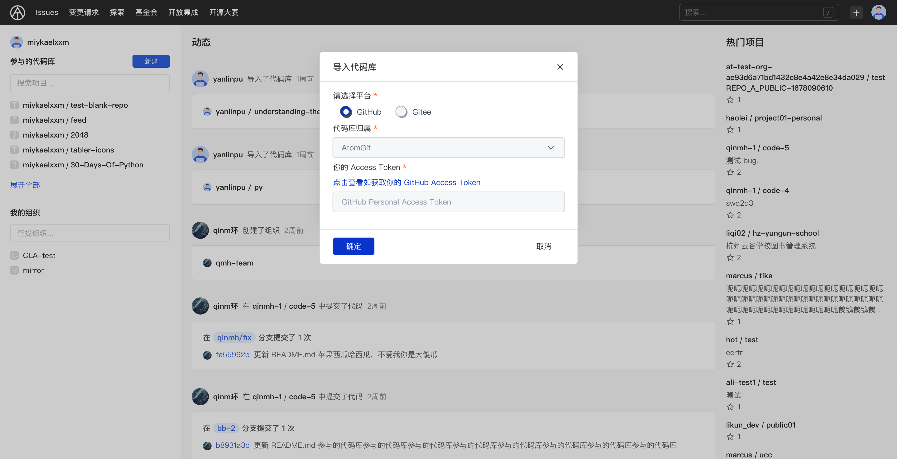
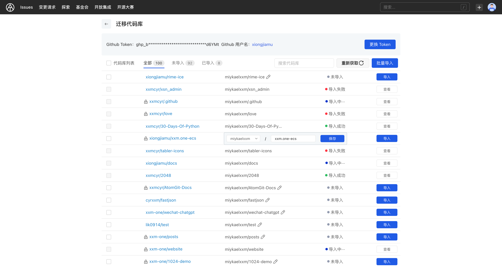

## Repository migrate

AtomGit provides a repository migration function, allowing users to import GitHub and Gitee repository data through personal access keys (PAT). Currently, it supports the import of basic information and git warehouses.

## Prepare personal access key

To use AtomGit's repository migration function, you need to first prepare the Personal Access Token corresponding to the repository hosting platform. Through this key, AtomGit can obtain repository information from platforms such as GitHub and Gitee.

- Generate a personal access key for GitHub:
  1. Log in to GitHub and open [Settings]
  2. Select [Developer settings] in the left navigation
  3. Select [Personal access tokens]
  4. Click the [Generate new token] button
  5. Fill in the Token description, select the repo permissions, and click the [Generate token] button
  6. Copy the generated Token and keep it properly
- Apply for Gitee's private token:
  1. Log in to Gitee and open [Personal Center]
  2. Select [Private Token] in the left navigation
  3. Fill in the token name and validity period, select the repo permissions, and click the [Create Token] button
  4. Copy the generated token and keep it properly

> It is recommended that the permissions of the personal access key be set to the read-only permissions of the repository, and must include the repo permissions, otherwise the repository information will not be obtained.

## Migrate repository

1. Open AtomGit, click the "+" sign in the upper right corner, and select [Import repository]
2. Choose which platform to migrate the repository from. GitHub and Gitee are currently supported.
3. Select the namespace to which the repository will belong after migration, including the user's own and the organization's namespace.
4. Enter the personal access key for the corresponding platform and click [OK]

> The selected namespace is only the default ownership, and the ownership of each repository can be modified in the import interface.

### Import repository

After completing the above steps, you will enter the repository list page to be imported, which will display:

-Token information used and user name of the corresponding platform

- List of all repositories, including private, organization-wide repositories and repositories participating as collaborators
- repository import status: not imported, importing, import successful
- The repository address of the original platform and the imported AtomGit address
- Supported operations:
  - Change Token
  - Batch Import
  - single import
  - Search repository
  - Re-obtain the repository list

> You can import single or multiple repositories on this page, modify the ownership of each repository, view the imported repositories, etc.

## Common problems

1. What should I do if I want to change the ownership of the repository?

- Unimported repository:
   1. Find the repository
   2. Click Modify Attribution
   3. Select the new ownership and save
   4. Click the [Import] button
- Imported repository:
   1. Enter the repository settings and delete the repository
   2. Return to the repository list to be imported and modify the ownership
   3. Select the owning namespace
   4. Click the [Import] button

2. I forgot the token I used last time. Do I need to regenerate it?

No, AtomGit will use the last Token by default. As long as the Token has not been deleted and is still valid, it can continue to be used.

3. Can the Token be deleted in GitHub/Gitee after importing?

Removal is possible but not recommended. In addition to importing the repository, AtomGit will use this token to synchronize the imported repository from the original platform every day. If the Token is deleted, the imported repository will not be updated synchronously. If synchronous updates are not required, the Token can be deleted.
