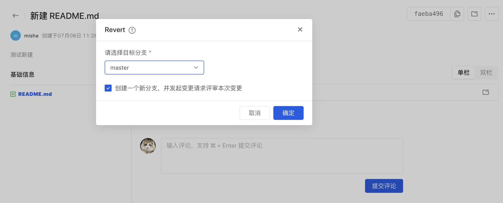
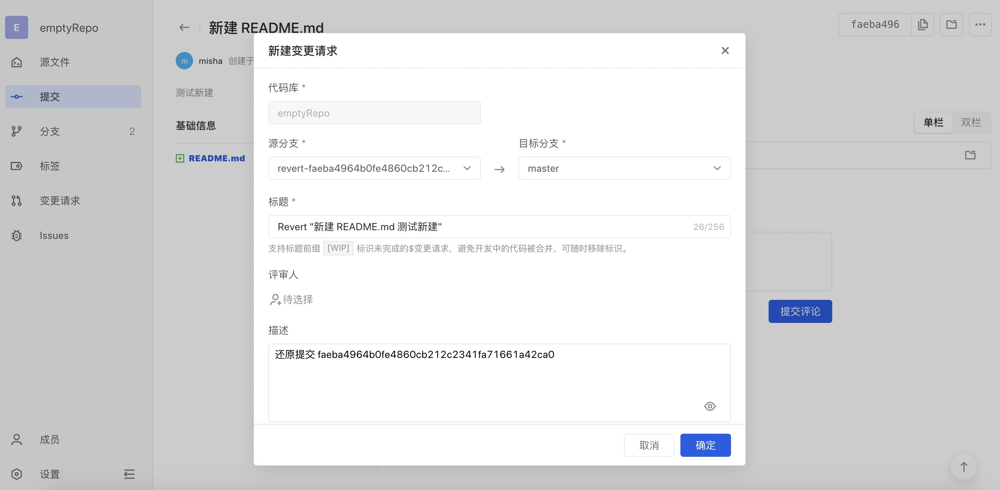
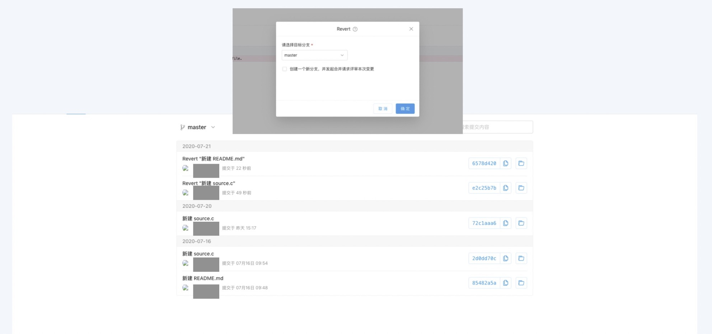

The function of the `git revert` command is to undo an operation and roll back the previous commit with a new commit.

Click the submission name to expand the submission details, and click "..." in the upper right corner to revert the current submission:

In the pop-up window, select the target branch you want to submit:

It is recommended to check the box to create a new branch and merge the code after reviewing it through a change request to ensure that the merge process is compliant and traceable:

If you do not choose to use change requests, you can also directly push the current submission to the target branch to complete the revert:

