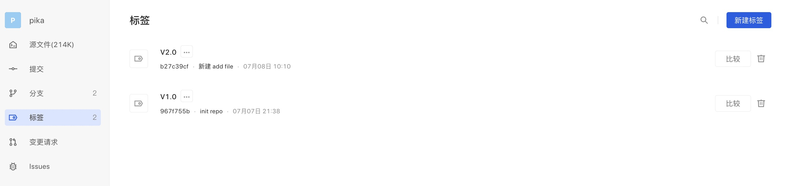
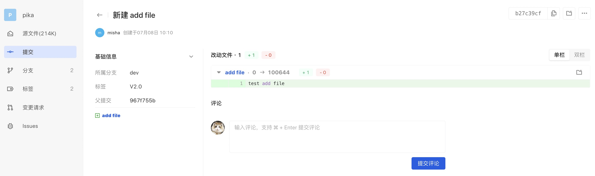
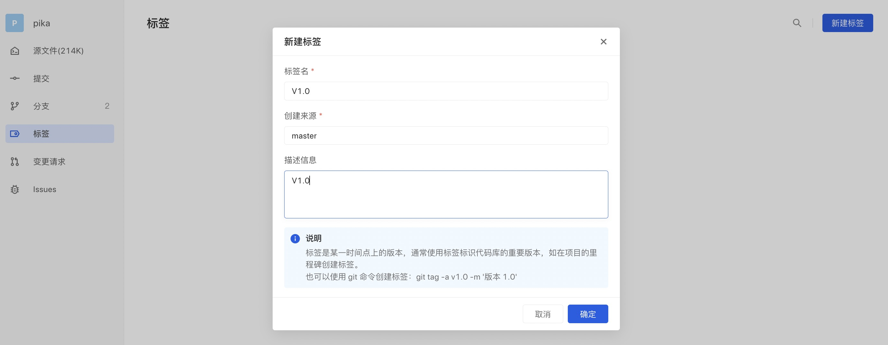
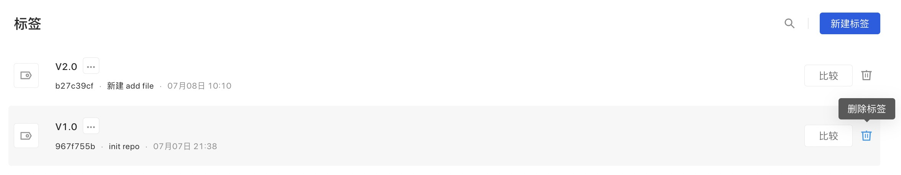

### 什么是标签

标签是某一时间点上的版本，通常使用标签标识代码库的重要版本，如在项目的里程碑创建标签。

Git 使用两种主要类型的标签：轻量标签（lightweight）与附注标签（annotated）。更多 Git 标签信息可以查阅 Git 手册的 Git 基础 - 打标签。

### 查看标签
查看标签有两个入口：「标签」和「提交」。

#### 在 「标签」中查看

在 「标签」页可以查看标签列表。
附注标签显示标签名、描述信息。
轻量级标记显示为标签名和提交。

可以通过标签名称进行过滤搜索。

#### 在 「提交」中查看

在提交记录中查看标签：

### 创建标签
开发者角色有权限创建标签。

在 「标签」中点击 「新建标签」，输入标签名，指定创建来源，输入描述信息，然后点击「确认」：

创建完成后会展示在标签列表中。

### 删除标签
开发者及以上权限可删除标签。

在标签列表中选择要删除的标签，点击 「删除」图标，点击「确认」就完成了对选择标签的删除：
