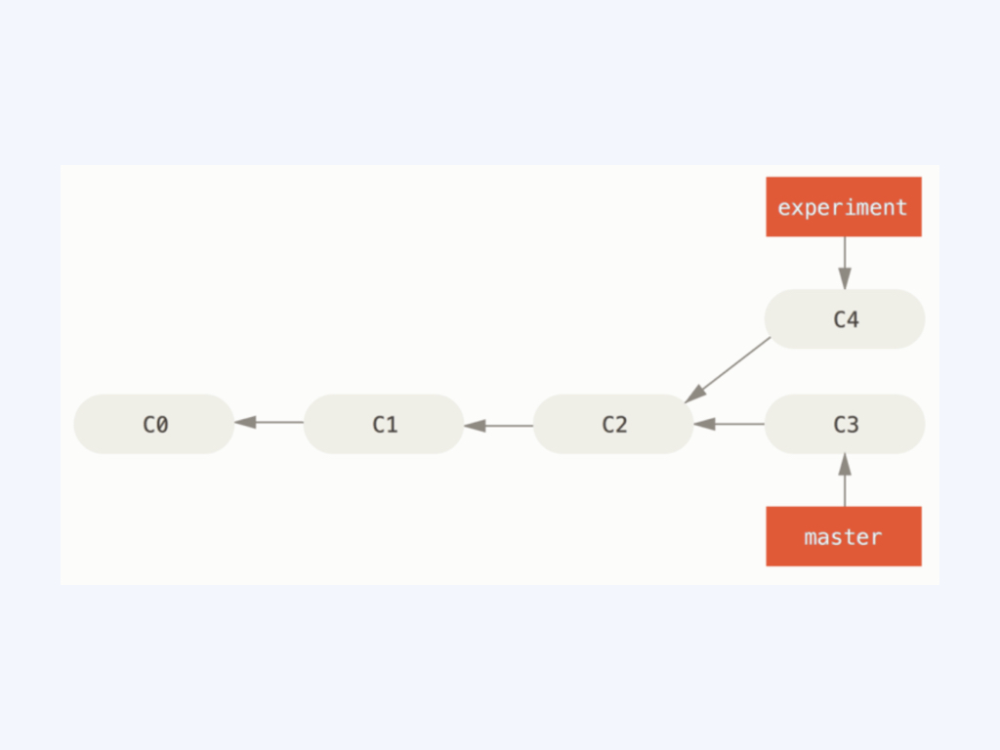
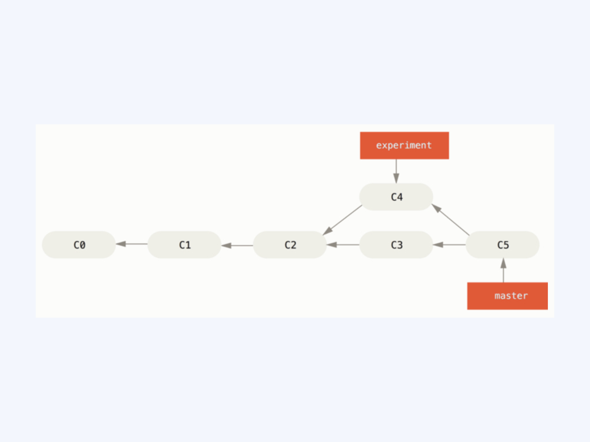
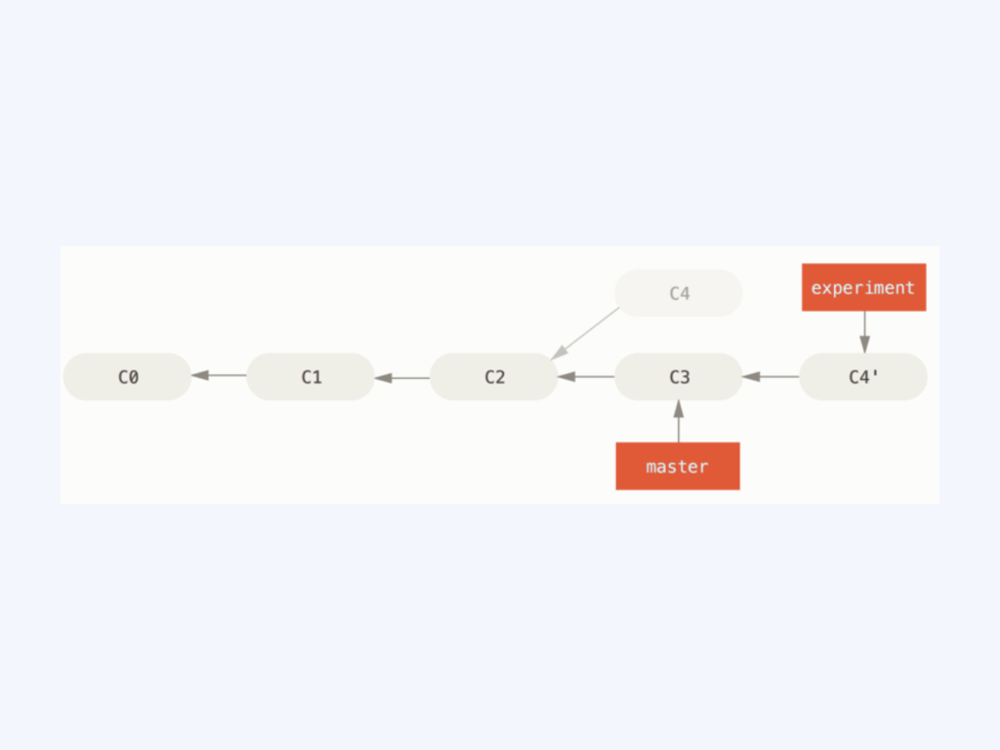
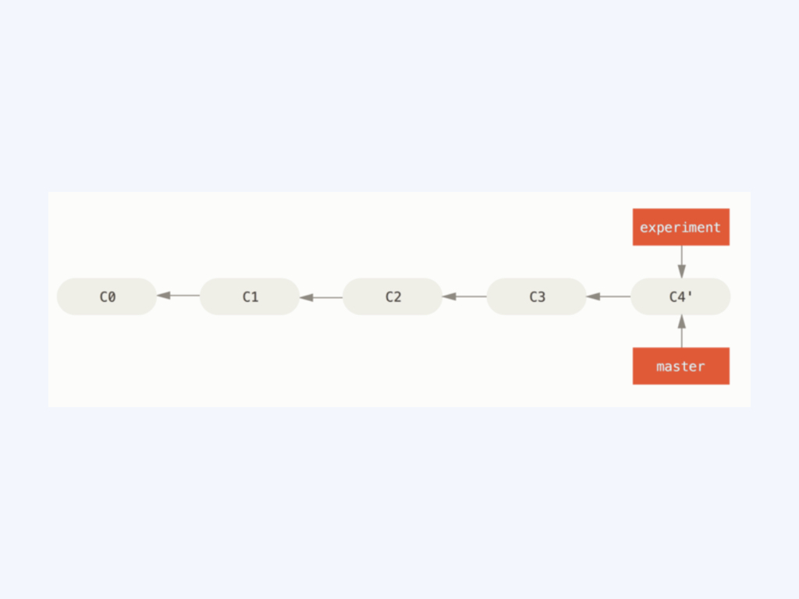

### 定制你的快捷命令

Git 有一个小技巧可以使你的 Git 体验更简单、容易、熟悉：别名。 如果不想每次都输入完整的 Git 命令，可以通过 git config 来轻松地为每一个命令设置一个别名。 这里有一些例子你可以试试

```bash
$ git config --global alias.co checkout 
$ git config --global alias.br branch 
$ git config --global alias.ci "commit -s"
$ git config --global alias.st status
```

这意味着，当要输入 git commit -s 时，只需要输入 git ci。 随着你继续不断地使用 Git，可能也会经常使用其他命令，所以创建别名时不要犹豫。例如，为了解决取消暂存文件的易用性问题，可向 Git 中添加你自己的取消暂存别名：

```bash
$ git config --global alias.unstage 'reset HEAD --'
```

这会是下面的两个命令等价：

```bash
$ git unstage fileA 
$ git reset HEAD -- fileA
```

这样看起来更清楚一些。 通常也会添加一个 Last 命令，像这样：

```bash
$ git config --global alias.last 'log -1 HEAD'
```

这样，可以轻松地看到最后一次提交：

```bash
$ git last   
commit 66938dae3329c7aebe598c2246a8e6af90d04646 Author: Josh Goebel  <dreamer3@example.com> Date:   Tue Aug 26 19:48:51 2008 +0800      test for current head      Signed-off-by: Scott Chacon <schacon@example.com>
```

### 代码合并与变基
在 Git 中整合来自不同分支的修改主要有两种方法：合并（merge） 以及变基（rebase）。

#### 合并
对于两个分支，如下图：

整合分支最容易的方法是 Merge 命令。 它会把两个分支的最新快照（C3和 C4）以及二者最近的共同祖先（C2）进行三方合并，合并的结果是生成一个新的快照（并提交）


#### Rebase合并
你可以提取在 C4 中引入的补丁和修改，然后在 C3的基础上应用一次。 在 Git 中，这种操作就叫做 变基。 你可以使用 rebase命令将提交到某一分支上的所有修改都移至另一分支上，就好像“重新播放”一样。

在上面这个例子中，运行：

```bash
$ git checkout experiment 
$ git rebase master 
First, rewinding head to replay your work on top of it...
Applying: added staged command
```

它的原理是首先找到这两个分支（即当前分支 Experiment、变基操作的目标基底分支 Master）的最近共同祖先 C2，然后对比当前分支相对于该祖先的历次提交，提取相应的修改并存为临时文件，然后将当前分支指向目标基底 C3, 最后以此将之前另存为临时文件的修改依序应用。



现在回到 master 分支，进行一次快进合并。

```bash
$ git checkout master 
$ git merge experiment
```



#### 优雅地合并分支代码并提交

通过对比两种合并方法，rebase 的合并能够让提交历史变成串行，看起来更加整洁。所以在合并代码时，有的人喜欢 rebase 完成合并。此外，rebase 还有个作用，修改提交历史，下面会介绍如何通过 rebase 修改提交历史。

优雅的合并代码，就是通过适当的 rebase 修改提交历史，将本地自己开发多个提交进行适当的合并，然后再 rebase 合并分支。

### 代码暂存

有时，当你在项目的一部分上已经工作一段时间后，而这时你想要切换到另一个分支做一点别的事情。 问题是，你不想仅仅因为过会儿回到这一点而为做了一半的工作创建一次提交。 针对这个问题的答案是`git stash`命令。

`git stash`将未完成的修改保存到一个栈上，而你可以在任何时候重新应用这些改动。

为了演示，进入项目并改动几个文件，运行`git status`，可以看到有改动的状态：

```bash
$ git status 
Changes to be committed:   
(use "git reset HEAD <file>..." to unstage)  	
modified:   index.html  
Changes not staged for commit:   
(use "git add <file>..." to update what will be committed)   
(use "git checkout -- <file>..." to discard changes in working directory)  	
modified:   lib/simplegit.rb
```

现在想要切换分支，但是还不想要进行提交，运行 `git stash`或 `git stash save`：

```bash
$ git stash 
Saved working directory and index state \   
"WIP on master: 049d078 added the index file" 
HEAD is now at 049d078 added the index file 
(To restore them type "git stash apply")
```

工作目录变干净了，并且刚刚的修改都不存在了：

```bash
$ git status 
# On branch master nothing to commit, working directory clean
```

在这时，你能够轻易地切换分支并在其他地方工作；你的修改被存储在栈上。 要查看暂存的东西，可以使用 `git stash list`：

```bash
$ git stash list 
stash@{0}: WIP on master: 049d078 added the index file 
stash@{1}: WIP on master: c264051 Revert "added file_size" 
stash@{2}: WIP on master: 21d80a5 added number to log
```

在本例中，有两个之前做的暂存，所以你接触到了三个不同的暂存工作。 可以通过原来 `stash `命令的帮助提示中的命令将你刚刚暂存的工作重新应用：`git stash apply`。 如果想要应用其中一个更旧的暂存，可以通过名字指定它，像这样：`git stash apply stash@{2}`。 如果不指定一个暂存，Git 认为指定的是最近的暂存：

```bash
$ git stash apply 
# On branch master 
# Changed but not updated:
#   (use "git add <file>..." to update what will be committed) 
# 
#      modified:   index.html 
#      modified:   lib/simplegit.rb #
```

可以看到 Git 重新修改了当你暂存时撤消的文件。 也可以运行` git stash pop`来应用暂存并从栈上扔掉它。

暂存的丢弃可以运行` git stash drop`加上将要移除的暂存的名字来移除它：

```bash
$ git stash list 
stash@{0}: WIP on master: 049d078 added the index file 
stash@{1}: WIP on master: c264051 Revert "added file_size" 
stash@{2}: WIP on master: 21d80a5 added number to log 
$ git stash drop stash@{0} 
Dropped stash@{0} (364e91f3f268f0900bc3ee613f9f733e82aaed43)
```

#### 从暂存创建一个分支

如果暂存了一些工作，在后续重新应用工作时可能会有问题。 如果应用尝试修改刚刚修改的文件，你会得到一个合并冲突并不得不解决它。 如果想要一个轻松的方式来再次测试储藏的改动，可以运行 `git stash branch`创建一个新分支，检出暂存工作时所在的提交，重新在那应用工作，然后在应用成功后扔掉：

```bash
$ git stash branch testchanges 
Switched to a new branch "testchanges" 
# On branch testchanges
# Changes to be committed: 
#   (use "git reset HEAD <file>..." to unstage) 
# 
#      modified:   index.html 
# 
# Changed but not updated: 
#   (use "git add <file>..." to update what will be committed) 
# 
#      modified:   lib/simplegit.rb # Dropped refs/stash@{0} (f0dfc4d5dc332d1cee34a634182e168c4efc3359)
```

这是在新分支轻松恢复暂存工作并继续工作的一个很不错的途径。

### 修改代码历史
许多时候，在使用 Git 时，可能会因为某些原因想要修正提交历史。 Git 很棒的一点是它允许你在最后时刻做决定。 你可以重写已经发生的提交就像它们以另一种方式发生的一样。 这可能涉及改变提交的顺序，改变提交中的信息或修改文件，将提交压缩或是拆分，或完全地移除提交 - 在将你的工作成果与他人共享之前。

在本节中，你可以学到如何完成这些非常有用的工作，这样在与他人分享你的工作成果时你的提交历史将如你所愿地展示出来。

#### 修改最后一次提交

修改你最近一次提交可能是所有修改历史提交的操作中最常见的一个。 对于你的最近一次提交，你往往想做两件事情：修改提交信息，或者修改你添加、修改和移除的文件的快照。

如果，你只是想修改最近一次提交的提交信息，那么很简单：

```bash
$ git commit --amend
```

这会把你带入文本编辑器，里面包含了你最近一条提交信息，供你修改。 当保存并关闭编辑器后，编辑器将会用你输入的内容替换最近一条提交信息。

如果你已经完成提交，又因为之前提交时忘记添加一个新创建的文件，想通过添加或修改文件来更改提交的快照，也可以通过类似的操作来完成。 通过修改文件然后运行 git add或 git rm 一个已追踪的文件，随后运行 git commit --amend 拿走当前的暂存区域并使其做为新提交的快照。

使用这个技巧的时候需要小心，因为修正会改变提交的 SHA-1 校验和。 它类似于一个小的变基 - 如果已经推送了最后一次提交就不要修正它。

#### 修改多个提交信息

为了修改在提交历史中较远的提交，必须使用更复杂的工具。 Git 没有一个改变历史工具，但是可以使用变基工具来变基一系列提交，基于它们原来的 HEAD 而不是将其移动到另一个新的上面。 通过交互式变基工具，可以在任何想要修改的提交后停止，然后修改信息、添加文件或做任何想做的事情。 可以通过给 git rebase增加 -i 选项来交互式地运行变基。 必须指定想要重写多久远的历史，这可以通过告诉命令将要变基到的提交来做到。

例如，如果想要修改最近三次提交信息，或者那组提交中的任意一个提交信息，将想要修改的最近一次提交的父提交作为参数传递给 git rebase -i 命令，即 HEAD~2^ 或 HEAD~3。 记住 ~3 可能比较容易，因为你正尝试修改最后三次提交；但是注意实际上指定了以前的四次提交，即想要修改提交的父提交：

```bash
$ git rebase -i HEAD~3
```

再次记住这是一个变基命令 - 在 HEAD~3..HEAD 范围内的每一个提交都会被重写，无论你是否修改信息。 不要涉及任何已经推送到中央服务器的提交 - 这样做会产生一次变更的两个版本，因而使他人困惑。运行这个命令会在文本编辑器上给你一个提交的列表，看起来像下面这样：

```bash
pick f7f3f6d changed my name a bit 
pick 310154e updated README formatting and added blame 
pick a5f4a0d added cat-file  
# Rebase 710f0f8..a5f4a0d onto 710f0f8 
# 
# Commands: 
#  p, pick = use commit 
#  r, reword = use commit, but edit the commit message 
#  e, edit = use commit, but stop for amending 
#  s, squash = use commit, but meld into previous commit 
#  f, fixup = like "squash", but discard this commit's log message 
#  x, exec = run command (the rest of the line) using shell 
# 
# These lines can be re-ordered; they are executed from top to bottom. 
# 
# If you remove a line here THAT COMMIT WILL BE LOST. 
# 
# However, if you remove everything, the rebase will be aborted. 
# 
# Note that empty commits are commented out
```

需要重点注意的是相对于正常使用的 log 命令，这些提交显示的顺序是相反的。 运行一次 log 命令，会看到类似这样的东西：

```bash
$ git log --pretty=format:"%h %s" HEAD~3..HEAD 
a5f4a0d added cat-file 
310154e updated README formatting and added blame 
f7f3f6d changed my name a bit
```

注意其中的反序显示。 交互式变基给你一个它将会运行的脚本。 它将会从你在命令行中指定的提交（HEAD~3）开始，从上到下的依次重演每一个提交引入的修改。 它将最旧的而不是最新的列在上面，因为那会是第一个将要重演的。

你需要修改脚本来让它停留在你想修改的变更上。 要达到这个目的，你只要将你想修改的每一次提交前面的 ‘pick’ 改为 ‘edit’。 例如，只想修改第三次提交信息，可以像下面这样修改文件：

```bash
edit f7f3f6d changed my name a bit 
pick 310154e updated README formatting and added blame 
pick a5f4a0d added cat-file
```

当保存并退出编辑器时，Git 将你带回到列表中的最后一次提交，把你送回命令行并提示以下信息：

```bash
$ git rebase -i HEAD~3 
Stopped at f7f3f6d... changed my name a bit 
You can amend the commit now, with
         git commit --amend  
Once you’re satisfied with your changes, run
         git rebase --continue
```

这些指令准确地告诉你该做什么。 输入

```bash
$ git commit --amend
```

修改提交信息，然后退出编辑器。 然后，运行

```bash
$ git rebase --continue
```

这个命令将会自动地应用另外两个提交，然后就完成了。 如果需要将不止一处的 pick 改为 edit，需要在每一个修改为 edit 的提交上重复这些步骤。 每一次，Git 将会停止，让你修正提交，然后继续直到完成。

#### 重新排序提交

也可以使用交互式变基来重新排序或完全移除提交。 如果想要移除 “added cat-file” 提交然后修改另外两个提交引入的顺序，可以将变基脚本从这样：

```bash
pick f7f3f6d changed my name a bit 
pick 310154e updated README formatting and added blame pick 
a5f4a0d added cat-file
```

改为这样：

```bash
pick 310154e updated README formatting and added blame 
pick f7f3f6d changed my name a bit
```

当保存并退出编辑器时，Git 将你的分支带回这些提交的父提交，应用 310154e，然后应用 f7f3f6d，最后停止。 事实修改了那些提交的顺序并完全地移除了 “added cat-file” 提交。

#### 压缩提交

通过交互式变基工具，也可以将一连串提交压缩成一个单独的提交。 在变基信息中脚本给出了有用的指令：

```bash
# 
# Commands: 
#  p, pick = use commit 
#  r, reword = use commit, but edit the commit message 
#  e, edit = use commit, but stop for amending 
#  s, squash = use commit, but meld into previous commit 
#  f, fixup = like "squash", but discard this commit's log message 
#  x, exec = run command (the rest of the line) using shell 
# 
# These lines can be re-ordered; they are executed from top to bottom. 
# 
# If you remove a line here THAT COMMIT WILL BE LOST. 
# 
# However, if you remove everything, the rebase will be aborted. 
# 
# Note that empty commits are commented out
```

如果，指定 “squash” 而不是 “pick” 或 “edit”，Git 将应用两者的修改并合并提交信息在一起。 所以，如果想要这三次提交变为一个提交，可以这样修改脚本：

```bash
pick f7f3f6d changed my name a bit squash 
310154e updated README formatting and added blame squash 
a5f4a0d added cat-file
```

当保存并退出编辑器时，Git 应用所有的三次修改然后将你放到编辑器中来合并三次提交信息：

```bash
# This is a combination of 3 commits. 
# The first commit's message is: changed my name a bit  
# This is the 2nd commit message:  updated README formatting and added blame  
# This is the 3rd commit message:  added cat-file
```

当你保存之后，你就拥有了一个包含前三次提交的全部变更的提交。

#### 拆分提交

拆分一个提交会撤消这个提交，然后多次地部分地暂存与提交直到完成你所需次数的提交。 例如，假设想要拆分三次提交的中间那次提交。 想要将它拆分为两次提交：第一个 “updated README formatting”，第二个 “added blame” 来代替原来的 “updated README formatting and added blame”。 可以通过修改 `rebase -i`的脚本来做到这点，将要拆分的提交的指令修改为 “edit”：

```bash
pick f7f3f6d changed my name a bit edit 
310154e updated README formatting and added blame pick 
a5f4a0d added cat-file
```

然后，当脚本将你进入到命令行时，重置那个提交，拿到被重置的修改，从中创建几次提交。 当保存并退出编辑器时，Git 带你到列表中第一个提交的父提交，应用第一个提交（f7f3f6d），应用第二个提交（310154e），然后让你进入命令行。 那里，可以通过 `git reset HEAD^ `做一次针对那个提交的混合重置，实际上将会撤消那次提交并将修改的文件未暂存。 现在可以暂存并提交文件直到有几个提交，然后当完成时运行 `git rebase --continue`：

```bash
$ git reset HEAD^ 
$ git add README 
$ git commit -m 'updated README formatting' 
$ git add lib/simplegit.rb 
$ git commit -m 'added blame' 
$ git rebase --continue
```

Git 在脚本中应用最后一次提交（a5f4a0d），历史记录看起来像这样：

```bash
$ git log -4 --pretty=format:"%h %s" 
1c002dd added cat-file 
9b29157 added blame 35cfb2b updated README formatting 
f3cc40e changed my name a bit
```

再次强调，这些改动了所有在列表中的提交的 SHA-1 校验和，所以要确保列表中的提交还没有推送到共享仓库中。