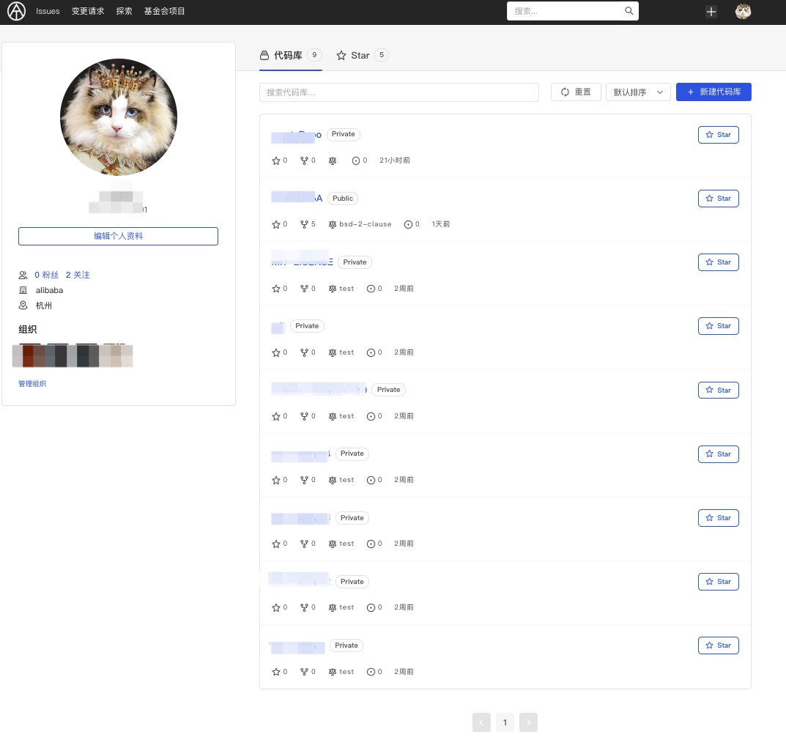
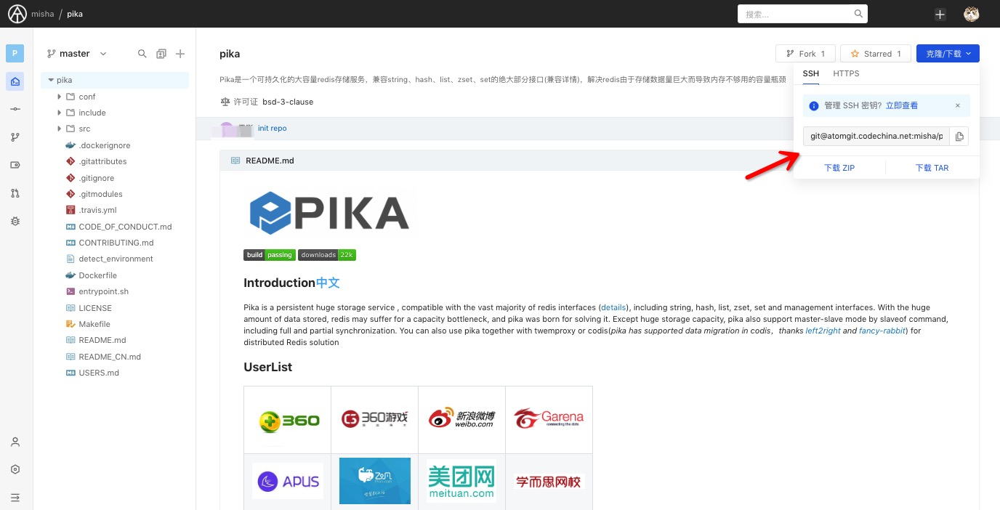

### 1.Start your work based on the repository

In Git, when you need to check out a repository, it is called a "clone" in Git. If you need to use a git repository locally (that is, on your own computer), you must first clone it. So at this point, you need to know the repository information to be cloned.

Log in to the AtomGit platform, enter the homepage, and display the repository list. Click to enter the specific repository.


When you are in a repository, click the "SSH" or "HTTP" selection button in the center of the screen, and then click the address copy button on the right.


### 2.CLI commands

#### 1）clone repository

Open a Shell terminal on your computer and enter the following command

```
git clone <repo url>
```

If you are using SSH and have completed the previous Setup steps, a remote repository will be successfully cloned to your local environment if the permissions are correct.

If you are using HTTP, you need to enter your login account and password or Token.

#### 2）Enter the repository, directory or manipulate files to continue working

```
cd <repo-name>
```

#### 3）Create a README.md file in the directory

```
vi README.md
```

#### 4）Add files to the index area

```
git add README.md
```

#### 5）Create a commit

```
git commit -s -m "Initial commit"
```

### 3.Other common Git commands

#### 1）checkout to master branch

```
git checkout master
```

#### 2）check the remote repo url

```
git remote -v
```

#### 3）relate the local branch with the remote branch (such as the remote master branch)

```
git branch -u origin/master
```

#### 4）Synchronize - 01

If it diverges from the remote branch, perform a pull to complete the update

```
git pull
```

#### 5）Synchronize - 02

If it diverges from the remote branch, submit the local difference and rebase it to the remote branch to complete the update

```
git pull --rebase
```

#### 6）Create a branch

```
git checkout -b <branch> <start-point>
```

#### 7）Switch to an existing local branch

```
git checkout <branch>
```

#### 8）View the file modification status

It's important to understand what happened and the status of file changes.

```
git status
```

#### 9）Push local commits to the remote repo

```
git push
```
