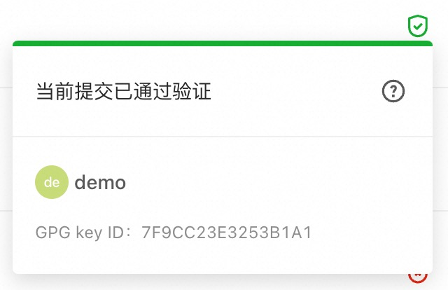

> Although Git is cryptographically secure, it is not foolproof. When someone's user password is leaked, or someone wants to maliciously forge other people's submissions, they may impersonate someone you trust and submit malicious code to your code repository. You can use GPG to sign your commits or tags locally. AtomGit will verify these signatures to ensure that the commit record or tag comes from a trusted source.

## How AtomGit handles GPG signatures

AtomGit uses its own keychain to verify GPG signatures, it does not access any public key servers.

For commits to be verified by AtomGit:

- Submitters must have a GPG public/private key pair.
- The committer's public key must have been uploaded to their AtomGit account.
- The GPG key must contain an email address, and the email address must match the verified email address used by the committer in AtomGit.
- The email address of the committer of the commit record must match the email address verified in the GPG key.

## GPG Key

### GPG tool install

GPG is not installed by default on macOS or Windows. To install the GPG command line tools, see GnuPG's download page.

Windows

Windows recommend [Gpg4win](https://gpg4win.org/download.html)

macOS

macOS recommend [gpgtools](https://gpgtools.org/)

### View existing GPG key pairs

Before you generate a new key pair, you can check to see if there is an existing key pair.

Supported GPG key algorithms

AtomGit supports several GPG key algorithms. If you try to add a key generated using an unsupported algorithm, you may encounter an error:

- RSA
- ElGamal
- DSA

1. Open terminal (macOS or Linux users)/git bash (Windows users).
2. command `gpg --list-secret-keys --keyid-format LONG` can list GPG keys with both public and private keys. Signing a commit or token requires a private key.

    ``` SHELL
    gpg --list-secret-keys --keyid-format LONG
    ```

3. Check the command output to see if you have a GPG key pair.
  
   a. If there is no GPG key pair, or you do not want to use any existing keys to sign commits and tags, generate a new GPG key pair.

   b. If a GPG key pair already exists and you want to use it to sign commits and tags, add the GPG public key to your AtomGit account.

### Generate new key

If you don't have an existing GPG key pair, you can generate a new GPG key for signing commits and tags.

1. Install GPG for your operating system. If your operating system has gpg2 installed, please replace gpg with gpg2 in the following command.

2. Open Terminal (macOS or Linux users)/git bash (Windows users).
  
3. Generate a GPG key pair. Since there are multiple versions of GPG, you may need to consult the relevant man pages to find the appropriate key generation command. Your keys must use RSA.
   a. If you are using version 2.1.17 or higher, please paste the following text to generate a GPG key pair.

``` SHELL
gpg --full-generate-key
```

   b. if your version is lower than 2.1.17,then `gpg --full-generate-key` won't work, paste the text below, then jump to Step 6.

``` SHELL
gpg --default-new-key-algo rsa4096 --gen-key
```

4. At the prompt, specify the desired key type, or press Enter to accept the default `RSA and RSA`:

``` SHELL
Please select what kind of key you want:
  (1) RSA and RSA (default)
  (2) DSA and Elgamal
  (3) DSA (sign only)
  (4) RSA (sign only)
Your selection? 1
```

5. Enter the desired key size, your key must be at least 4096 bits:

``` SHELL
RSA keys may be between 1024 and 4096 bits long.
What keysize do you want? (2048) 4096
Requested keysize is 4096 bits
```

6. Enter the length of time the key is valid and press Enter to specify the default selection, indicating that the key has not expired:

``` SHELL
Please specify how long the key should be valid.
        0 = key does not expire
      <n>  = key expires in n days
      <n>w = key expires in n weeks
      <n>m = key expires in n months
      <n>y = key expires in n years
Key is valid for? (0) 0
Key does not expire at all
```

7. confirm your choice:

``` SHELL
Is this correct? (y/N) y
```

8. Enter your name (or nickname), the email address associated with this key (should match the verified email address you use with AtomGit), and an optional comment (press Enter to skip):

``` SHELL
GnuPG needs to construct a user ID to identify your key.

Real name: AtomGit
Email address: <your_email>
Comment:
You selected this USER-ID:
    "AtomGit <your_email>"

Change (N)ame, (C)omment, (E)mail or (O)kay/(Q)uit? O
```

9. Choose a strong password and confirm it twice.

10. use `gpg --list-secret-keys --keyid-format LONG`to list the GPG keys which has both public and private keys.Signing a commit or token requires a private key.

``` SHELL
gpg --list-secret-keys --keyid-format LONG <your_email>
```

use your own email to replace `<your_email>`.
11. Copy the GPG key ID that starts with sec . In the following example, it's 30F2B65B9246B6CA:

``` SHELL
sec   rsa4096/30F2B65B9246B6CA 2017-08-18 [SC]
      D5E4F29F3275DC0CDA8FFC8730F2B65B9246B6CA
uid                   [ultimate] AtomGit <your_email>
ssb   rsa4096/B7ABC0813E4028C0 2017-08-18 [E]
```

12. export the public of this ID(Replace example 30F2B65B9246B6CA with the key ID from the previous step):

``` SHELL
gpg --armor --export 30F2B65B9246B6CA
```

13. Copy your GPG key's public key, which starts with`-----BEGIN PGP PUBLIC KEY BLOCK-----`, end with`-----END PGP PUBLIC KEY BLOCK-----`.
14. Add the public key of the GPG key to your AtomGit account.

## Add a GPG key to your account

> Once a key is added, it cannot be edited, only deleted. If pasting does not work, you must delete the offending key and add it again.

1. You can add the public key of the GPG key in GPG Keys in your personal settings (click your avatar in the upper right corner -> Personal Settings):


2. Navigate to the GPG Public Keys tab and paste your public key into the "Public Key" input box.

3. Finally, click the Add key to add it to AtomGit. You will be able to see its fingerprint, corresponding mailbox and creation date.

4. Please ensure that the email address of the GPG key is verified. If it is not verified, please add the email address to your personal information, or use an existing email address to generate a new GPG key.

## Associate your GPG key with Git

If the GPG key you're using matches your committer identity and the verified email address associated with your AtomGit account, it's time to tell Git which key to use.

1. Use the following command to list the private GPG key you just created:

``` SHELL
gpg --list-secret-keys --keyid-format LONG <your_email>
```

2. Copy the GPG key ID that starts with sec. In the following example, it is 30F2B65B9246B6CA:

``` SHELL
sec   rsa4096/30F2B65B9246B6CA 2017-08-18 [SC]
      D5E4F29F3275DC0CDA8FFC8730F2B65B9246B6CA
uid                   [ultimate] AtomGit <your_email>
ssb   rsa4096/B7ABC0813E4028C0 2017-08-18 [E]
```

3. Tell Git to use this key to sign commits:

``` SHELL
git config --global user.signingkey 30F2B65B9246B6CA
```

Replace `30F2B65B9246B6CA` with your GPG key ID.

The GPG key set through --global will be used as your default key. If you want to use other keys for certain warehouses, you can set them separately under the corresponding warehouse, such as:

``` SHELL
git config user.signingkey 30F2B65B9246B6CA
```

1. (Optional) If Git is using gpg and errors such as secret key not available or gpg: signing failed: secret key not available occur, run the following command to change to gpg2:

``` SHELL
git config --global gpg.program gpg2
```

## sign

### Sign the commit record

After creating the GPG key and adding it to your account, you can start signing commits:

1. You can commit as before, the only difference is the added -S flag:

``` SHELL
git commit -S -m "My commit msg"
```

Or specify a key ID. In the following example, it is 30F2B65B9246B6CA:

``` SHELL
git commit -S30F2B65B9246B6CA -m "My commit msg"
```

Replace `30F2B65B9246B6CA` with your GPG key ID.

2. Enter the password for your GPG key (if you have one) when asked.

3. Push to AtomGit and check whether your commit has been verified.

If you don't want to type the -S flag on every commit, you can tell Git to automatically sign your commits:

``` SHELL
git config --global commit.gpgsign true
```

### Sign the tag

In addition to signing commit records, you can also sign tags.

1. You can sign a tag by adding the -s flag:

``` SHELL
git tag -s mytag
```

Or specify a key ID. In the following example, it is 30F2B65B9246B6CA:

``` SHELL
git tag -s -u 30F2B65B9246B6CA mytag
```

Replace 30F2B65B9246B6CA with your GPG key ID.
2. Verify the signed tag by running `git tag -v [tag-name]`.
If you don't want to type the -s flag every time you create a tag, you can tell Git to automatically sign your commits:

``` SHELL
git config --global tag.gpgSign true
```

### Signature verification

There are two signature verification statuses:

1. Verification passed:



2. Verification failed:


when verification failed, there are serveral possible reasons:

- GPG public key signature verification failed.
- The GPG public key signature verification passed, and the submitter email (committer email) belongs to the current AtomGit user, but is inconsistent with the certificate email.
- The GPG public key signature verification passed, but the submitter email address (committer email) is inconsistent with the certificate email address.
- The GPG public key signature verification passed, but the certificate email address does not belong to the email address bound to the current AtomGit user.
- The GPG public key is not registered with AtomGit.

## Remove GPG key

### Revoke GPG key

Revoking a key will unverify signed commit records and tags. Commits verified with this key will become unverified. After revoking this key, future commits will remain unchanged. If your key has been If it has been stolen, this action should be used.

Revoke GPG key：

- In the upper right corner, click on your avatar and go to "Personal Settings".
- Navigate to GPG Keys.
- Click Undo next to the GPG public key you want to delete.

### Delete GPG key

Deleting a key will not unverify signed commits or tags. Commits or tags verified with this key will remain verified. After deleting this key, only commits that have not been pushed to AtomGit will remain unverified. To cancel To verify a signed commit, you need to revoke the associated GPG key from your account.

To remove the GPG key from your account:

- In the upper right corner, click on your avatar and go to "Personal Settings".
- Navigate to the GPG public key.
- Click Delete next to the GPG public key you want to delete.
