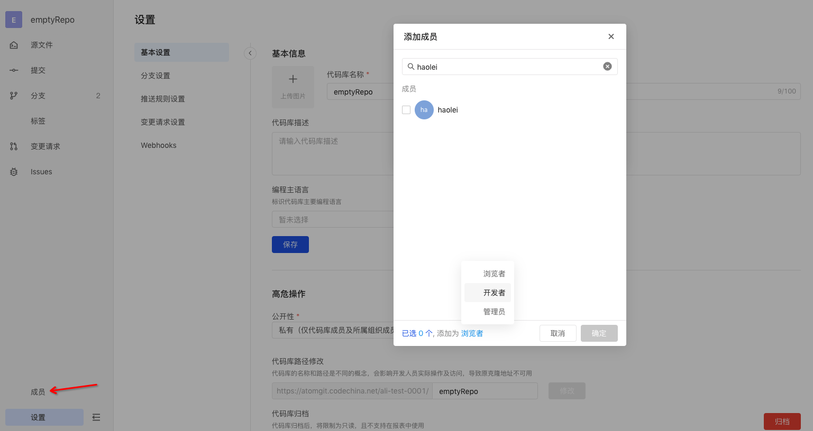

## Member Manage

### Invite

maintainer is operational. Click the Member Tab in the lower left corner of the library and select Add Member, search for a specific member (user name search), select the permissions you want to grant him, and then click OK to invite.

- The invited user will receive an email notification, click the Accept Invitation button in the email, and will be successfully invited to the library member list;
- The email has an expiration time of 7 days, after which the invitation will become invalid;
- If the library maintainer "revokes invitation" in the member management pop-up window, the invitation link will also become invalid;

### Change member permissions

maintainer is operational. Select a member in the library and click the role drop-down list on the right to change the member's permissions.

### Delete members

maintainer is operational. Select a member and click Remove Member to delete a member.
