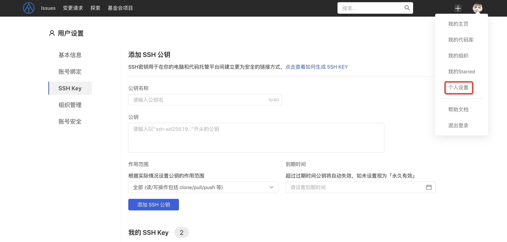

Code management supports two access protocols, HTTP(S) and SSH. The SSH protocol can achieve secure password-free authentication and has better performance than the HTTP(S) protocol (because HTTP is a stateless protocol and requires multiple connections and interactions). Before using the SSH protocol to operate the code warehouse, you first need to generate and upload your SSH public key and complete the correspondence between the SSH public key and the user account.

### Get SSH key
>
>Instructions If the Git client is not installed, please refer to [Installing Git](https://git-scm.com/download?spm=a2c4g.11186623.0.0.49962b5cKP0UrI).

#### Preparation

Install ssh-keygen, which is an OpenSSH component that is typically installed in Linux and macOS; if you use Windows, OpenSSH is also installed when you install Git for Windows.

#### Check whether the key already exists on this machine

(1) Public key exists
The current platform supports SSH keys generated by the ED25519 algorithm. First execute the following statement on your computer command line to determine whether the local public key already exists:
`cat ~/.ssh/id_ed25519.pub`
If a long string starting with ssh-ed25519 is returned, it means that the local public key already exists, and you can skip the following ssh-keygen steps.
(2) Public key does not exist - create a new key pair
If the local public key cannot be queried, you can regenerate the SSH key pair using the following command:
`ssh-keygen -t ed25519 -C "your_email@example.com"`
This command requires a location to store the public key and private key files. You can choose to use the default location to save the public key and private key files.
> Public key files ending with .pub extension can be disclosed to others, but private key files without .pub extension should not be disclosed to anyone!
You can choose to password-protect the private key file. If you do not want to enter the password used to protect the private key file every time you use the SSH protocol to access the warehouse, you can enter an empty password when creating the public key and private key files.

#### View public key

After the key pair already exists, (under Linux and Mac) you can use the following command to display and view the generated public key:
`cat ~/.ssh/id_ed25519.pub`

### Copy public key

If you plan to copy the public key to the pasteboard, please refer to the operating system and use the following command:
Windows:
`clip < ~/.ssh/id_ed25519.pub`
Mac:
`pbcopy < ~/.ssh/id_ed25519.pub`
GNU/Linux (requires xclip):
`xclip -sel clip < ~/.ssh/id_ed25519.pub`

### Set up SSH public key

Click the avatar in the upper right corner - Personal Settings - "SSH Public Key" to display the SSH public key setting pop-up window.
Paste the SSH public key that already exists on this machine into the input box, and name the current public key for easy management.

>Please copy the entire contents from ssh- to the mailbox.

In addition, it supports setting the scope of the public key. You can select "All" or "Read-only". If set to read-only, the public key can only be used to pull codes and is not allowed to be pushed.

If there is a need to limit the expiration time of the public key, you can set the expiration time of the public key. After expiration, the public key will automatically become invalid and cannot be used.

After the settings are completed, click "Add" to save the settings, and you can use the SSH key pair to perform code base operations.

