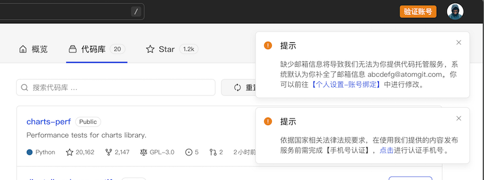

## Account

When using AtomGit's code hosting service, you need to register an AtomGit account. When registering an account, we will collect the following information:

- **Mobile phone number**, your mobile phone number, is used to complete the front-end user real-name authentication required by national laws and regulations.
- **Email account**, your email account, is necessary to provide you with Git code hosting services, similar to your local `git config user.email`
- **Username**, your username, necessary to provide you with Git code hosting services, similar to your local `git config user.name`

### Third-party account login

If you log in to the AtomGit platform through a third-party account, you still need to complete your mobile phone number and email account, including:
**Email account**, if you allow AtomGit to obtain the email information of the original platform when authorizing, we will use this email account; if the email information is not obtained when authorizing the login, the system will generate an <xxxxx@atomgit.com> for you by default. Email account, you can go to "Personal Settings - Account Binding" to modify it.

**Mobile phone number**. After authorized login, the system will prompt you to perform the "Verify mobile phone number" operation. If you do not verify your number, we will not be able to provide you with content including creating code libraries, creating Issues, posting comments, etc. publish service

