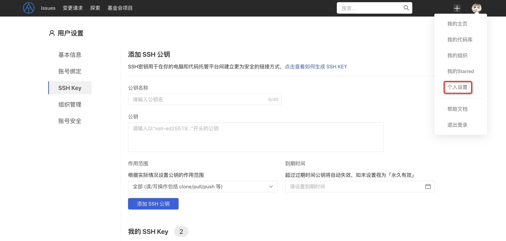

代码管理支持 HTTP(S) 和 SSH 两种访问协议，SSH 协议可以实现安全的免密认证，且性能比 HTTP(S) 协议更好（因为 HTTP 是无状态协议，需要多次连接和交互）。在使用 SSH 协议操作代码仓库前，首先需要生成并上传你的 SSH 公钥，完成 SSH 公钥和用户账号的对应。

### 获取 SSH 密钥
>说明 如未安装 Git 客户端，请参见[安装Git](https://git-scm.com/download?spm=a2c4g.11186623.0.0.49962b5cKP0UrI)。

#### 准备工作
安装 ssh-keygen，它是 OpenSSH 组件，在 Linux 和 macOS 中通常已安装；如果使用 Windows，安装 Git for Windows 时会同时安装 OpenSSH 。

#### 检查本机是否已存在密钥
（1）存在公钥
目前平台支持 ED25519 算法生成的 SSH 密钥，在你的计算机命令行中首先执行以下语句，判断是否已经存在本地公钥：
`cat ~/.ssh/id_ed25519.pub`
如果返回一长串以 ssh-ed25519 开头的字符串, 说明已存在本地公钥，你可以跳过以下 ssh-keygen 的步骤。

（2）不存在公钥-创建新密钥对

如果查询不到本地公钥，你可以按如下命令重新生成 SSH 密钥对 ：
`ssh-keygen -t ed25519 -C "your_email@example.com"`
该指令要求提供一个位置去存放公钥、私钥文件，你可以选择使用默认位置保存公钥、私钥文件。
> 公钥文件以 .pub 扩展名结尾，可以公开给其他人，而没有 .pub 扩展名的私钥文件不要泄露给任何人！

你可以选择使用口令保护私钥文件。如果你不想在每次使用 SSH 协议访问仓库时，都要输入用于保护私钥文件的口令，可以在创建公钥、私钥文件时，输入空口令。

#### 查看公钥
已存在密钥对后，（Linux、Mac 下）可以用以下命令显示查看生成的公钥：
`cat ~/.ssh/id_ed25519.pub`

### 拷贝公钥
如果打算拷贝公钥到粘贴板下，请参考操作系统使用以下命令：
Windows:
`clip < ~/.ssh/id_ed25519.pub`

Mac:
`pbcopy < ~/.ssh/id_ed25519.pub`

GNU/Linux (requires xclip):
`xclip -sel clip < ~/.ssh/id_ed25519.pub`

### 设置 SSH 公钥
点击右上角头像-个人设置-「SSH 公钥」展现 SSH 公钥设置弹窗。
将上述本机已存在的 SSH 公钥粘贴到输入框中，同时为当前公钥命名，便于区分管理。
>请完整拷贝从 ssh- 开始直到邮箱为止的内容。

除此之外，支持设置公钥作用范围，可选择「全部」或「只读」，若设置为只读，该公钥只能用于拉取代码，不允许推送。

如有公钥过期时间限制的需求，可设置该公钥的过期时间，到期后公钥自动失效，不可使用。

设置完成后，点击「添加」保存设置，即可使用该 SSH 密钥对执行代码库操作。

